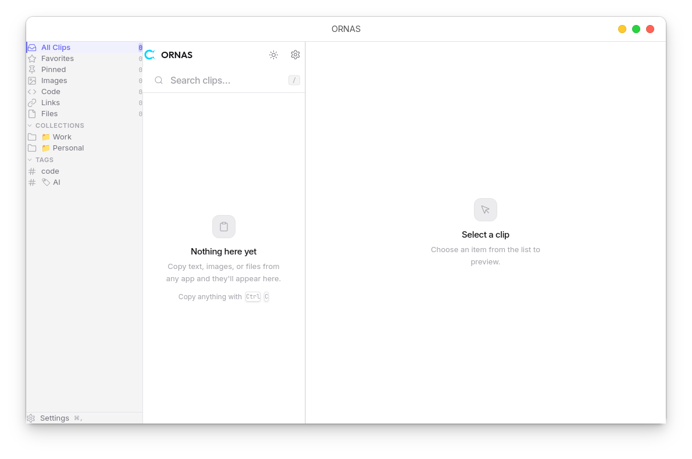
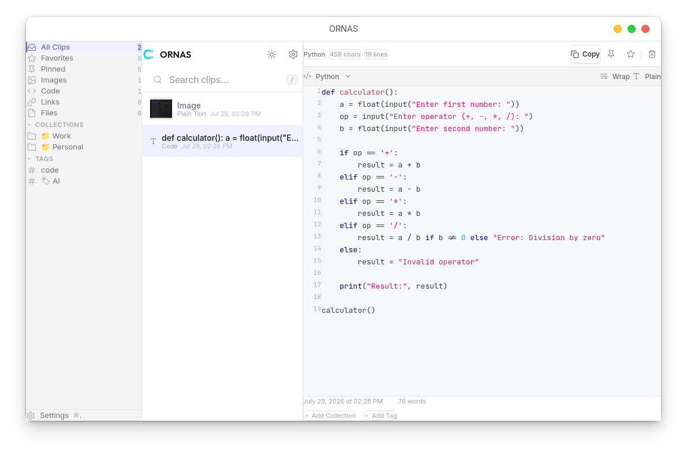
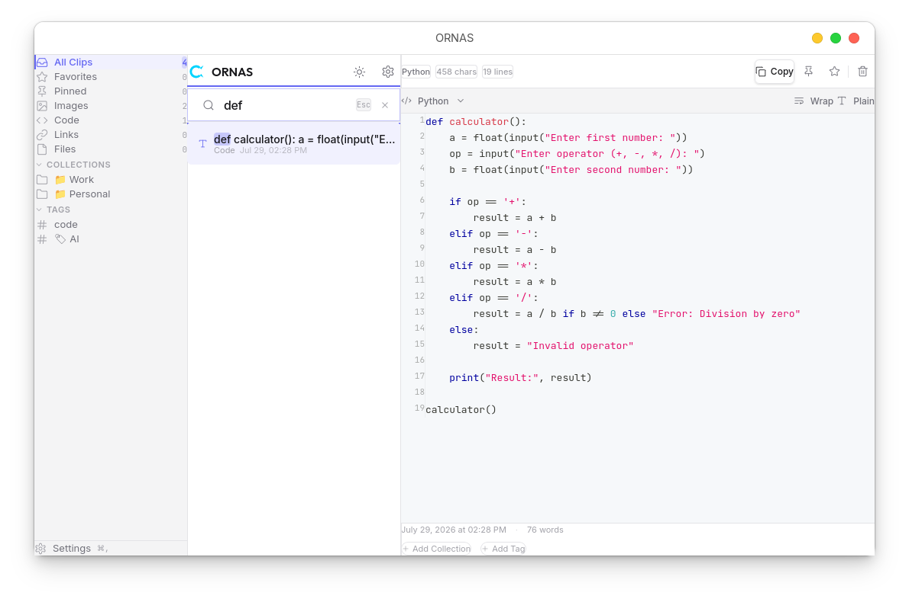
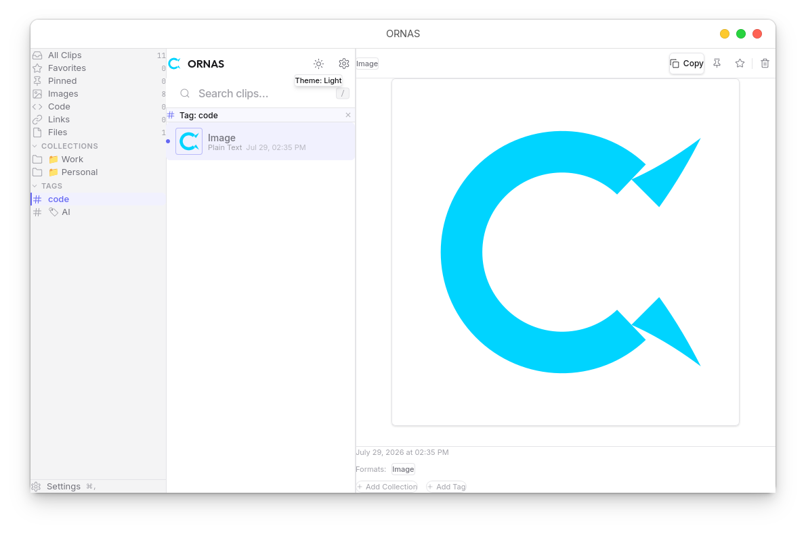
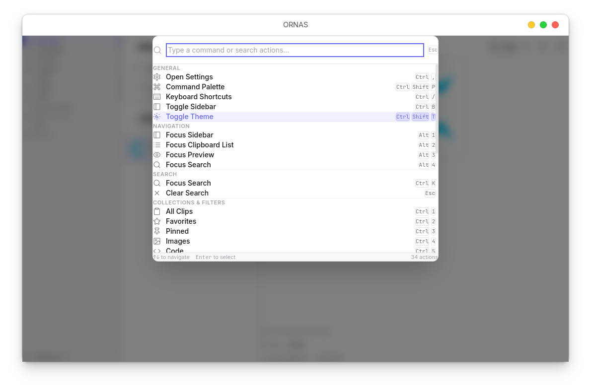
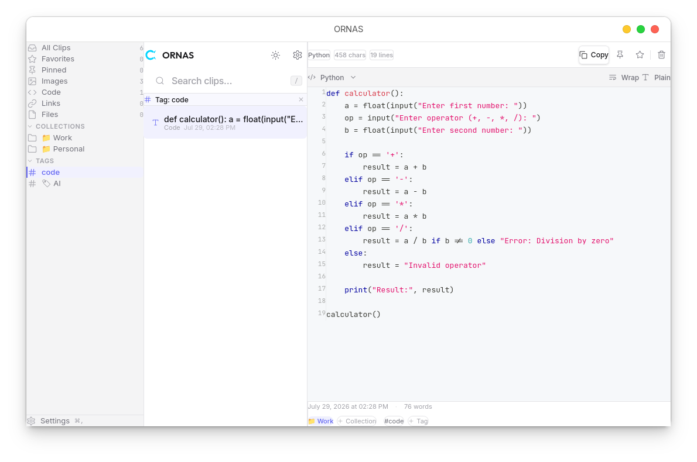
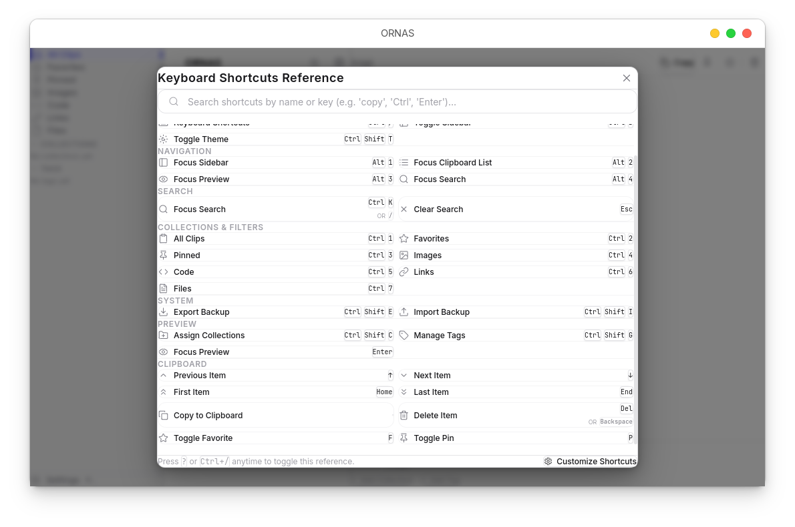
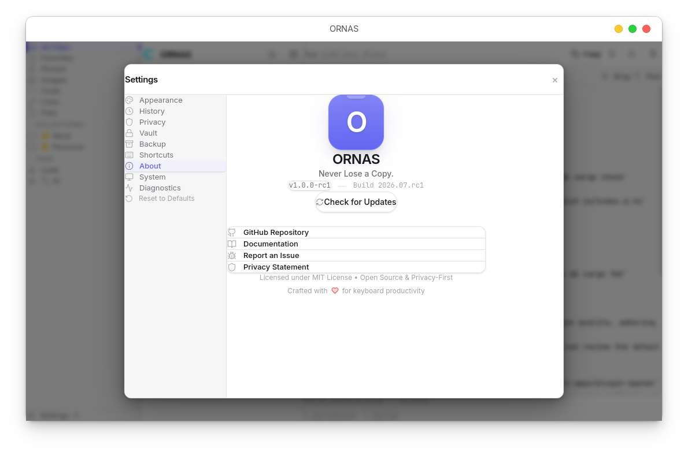
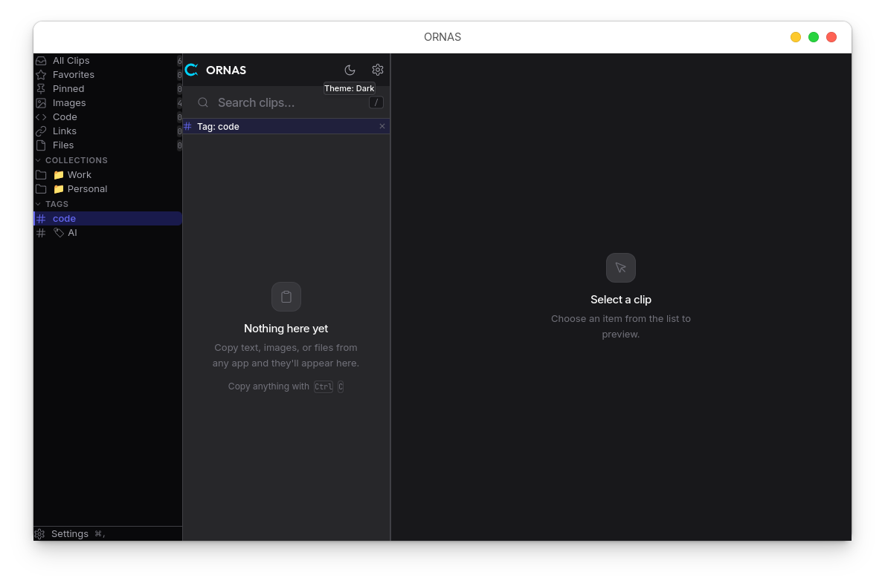
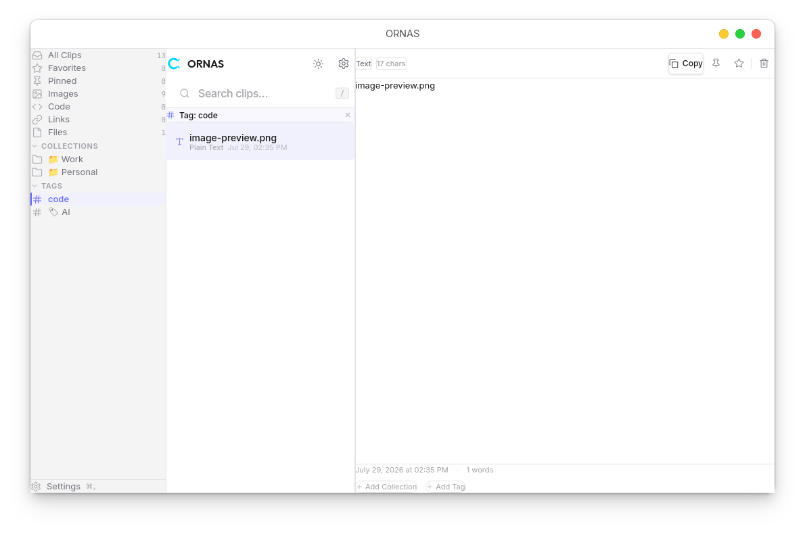

<div align="center">
  
  <h1>ORNAS</h1>
  <p><strong>Never Lose a Copy.</strong></p>
</div>

<p align="center">
  The open-source, offline-first clipboard manager for Linux, macOS, and Windows.
</p>

<p align="center">
  <a href="https://github.com/sanromarth/ornas/actions/workflows/release.yml"></a>
  <a href="https://github.com/sanromarth/ornas/releases"></a>
  <a href="https://tauri.app"></a>
  <a href="https://www.rust-lang.org"></a>
  <a href="https://www.sqlite.org"></a>
  <a href="LICENSE"></a>
</p>

---

## What is ORNAS?

ORNAS captures everything you copy — text, images, code, files, links — and keeps it organized, searchable, and private. It runs entirely on your machine.

Most clipboard managers are either too simple (no search, no images) or too invasive (cloud sync, telemetry, accounts). ORNAS is built differently.

**Zero telemetry. Zero cloud. Zero accounts.**

---

## Key Features

| Feature | Description |
|---------|-------------|
| 📋 **Automatic Capture** | Silently captures text, images, rich text, code, and files. |
| 🔍 **Instant Search** | Sub-millisecond full-text search powered by SQLite FTS5. |
| 🎨 **Code Preview** | Syntax highlighting for 20+ languages. |
| 🖼️ **Image History** | Captures and previews clipboard images natively. |
| ⭐ **Favorites & Pins** | Mark important clipboard items for quick access. |
| 🏷️ **Collections & Tags** | Organize clipboard items into custom groups. |
| 🔒 **Vault** | XChaCha20-Poly1305 encryption for sensitive items. |
| ⌨️ **Keyboard-First** | Command palette, customizable shortcuts, full list navigation. |
| ☑️ **Bulk Actions** | Multi-select with Shift/Ctrl, bulk delete, pin, or favorite. |
| 💾 **Automated Backups** | Background backups and one-click restore. |
| 🌗 **Dark & Light Themes** | Follows your system preference automatically. |

---

## Screenshots

<div align="center">



<sub>The main interface — three-panel layout with sidebar filtering, instant list, and rich preview.</sub>

</div>

---

<div align="center">
<table>
<tr>
<td align="center" width="50%">

<br /><sub><b>Code Preview</b> — Syntax highlighting for 20+ languages</sub>
</td>
<td align="center" width="50%">

<br /><sub><b>Instant Search</b> — Sub-millisecond FTS5 full-text search</sub>
</td>
</tr>
<tr>
<td align="center" width="50%">

<br /><sub><b>Image History</b> — Capture and preview clipboard images</sub>
</td>
<td align="center" width="50%">

<br /><sub><b>Command Palette</b> — Every action, one keystroke away</sub>
</td>
</tr>
<tr>
<td align="center" width="50%">

<br /><sub><b>Collections & Tags</b> — Organize your clipboard workspace</sub>
</td>
<td align="center" width="50%">

<br /><sub><b>Keyboard Shortcuts</b> — Customizable keybindings</sub>
</td>
</tr>
<tr>
<td align="center" width="50%" colspan="2">

<br /><sub><b>Settings</b> — Powerful preferences and configurations</sub>
</td>
</tr>
</table>
</div>

<div align="center">


<br /><br />


<sub>Available in light and dark themes — follows your system preference automatically.</sub>

</div>

---

## Platform Support

| Platform | Status |
|----------|--------|
| Linux | ✅ Fully Supported |
| macOS | ✅ Supported (unsigned, Gatekeeper warning expected — see [SIGNING.md](SIGNING.md)) |
| Windows | ✅ Supported (unsigned — see [SIGNING.md](SIGNING.md)) |

---

## Installation

Download the latest release for your OS from the **[Releases page](https://github.com/sanromarth/ornas/releases)**.

| Platform | Installer |
|----------|-----------|
| Linux (Debian/Ubuntu) | `.deb` |
| Linux (Fedora/RHEL) | `.rpm` |
| Linux (Universal) | `.AppImage` |
| macOS | `.dmg` |
| Windows | `.msi` or `.exe` |

> **macOS & Windows users**: The binary is currently unsigned. Your OS may display a security warning (Gatekeeper on macOS, SmartScreen on Windows). This is expected. See [SIGNING.md](SIGNING.md) for details and bypass instructions.

### Quick Start

Once installed, ORNAS runs quietly in your system tray.

1. Copy anything (text, images, files) in any application.
2. Press **`Ctrl/Cmd + Shift + V`** to open the ORNAS window.
3. Type to instantly search your history.
4. Press **`Enter`** to copy the selected item back to your clipboard.

---

## Keyboard Shortcuts

| Action | Shortcut |
|--------|----------|
| Toggle Window | `Ctrl/Cmd + Shift + V` |
| Command Palette | `Ctrl/Cmd + Shift + P` |
| Cheat Sheet | `Ctrl/Cmd + /` |
| Search Focus | `Ctrl/Cmd + K` or `/` |
| Navigate List | `↑ / ↓` |
| Copy Selected | `Space` or `Enter` |
| Multi-Select | `Shift + Click` or `Ctrl/Cmd + Click` |
| Delete Selected | `Del` |
| Settings | `Ctrl/Cmd + ,` |

Full shortcut reference is available in-app via the Cheat Sheet (`Ctrl/Cmd + /`) and fully customizable in **Settings → Shortcuts**.

---

## Privacy & Security

**Privacy is the core philosophy of ORNAS.**

- No analytics, no crash reporting, no usage tracking.
- No cloud sync, no uploads, no external servers.
- All data lives in a local SQLite database on your machine.
- Sensitive clipboard items can be encrypted with XChaCha20-Poly1305.

See [PRIVACY.md](PRIVACY.md) and [SECURITY.md](SECURITY.md) for the complete security model.

---

## Architecture Overview

ORNAS is built on a clean architecture model designed for performance and reliability:

- **Frontend**: React 19, TypeScript, Zustand, TailwindCSS v4.
- **Backend**: Rust 2024 edition, Tauri v2.
- **Pipeline**: 7-stage processing pipeline (Normalize → Hash → Dedup → Categorize → Metadata → Persist → Notify).
- **Storage**: SQLite in WAL mode with FTS5 for full-text search, 8 versioned migrations.
- **Security**: XChaCha20-Poly1305 encryption, Argon2id key derivation, `Zeroizing` key memory.

For the full specification, see [docs/ARCHITECTURE_FINAL.md](docs/ARCHITECTURE_FINAL.md).

---

## Backup & Restore

ORNAS automatically creates background backups based on your configured interval. You can also manually export your entire clipboard history (including images) as a `.zip` archive from **Settings → Backup**.

To restore, use the Restore Wizard in Settings to safely merge or replace your database with a backup file.

---

## Building from Source

### Prerequisites

- [Rust](https://rustup.rs) 1.85+
- [Node.js](https://nodejs.org) 20+
- **Linux only**: `libwebkit2gtk-4.1-dev`, `libgtk-3-dev`, `libayatana-appindicator3-dev`

### Build Instructions

```bash
# Clone the repository
git clone https://github.com/sanromarth/ornas.git
cd ornas

# Install frontend dependencies
npm install

# Run in development mode
npm run tauri dev

# Build for production
npm run tauri build
```

See [DEVELOPMENT_SETUP.md](DEVELOPMENT_SETUP.md) for full setup details, including Linux system dependencies.

---

## Contributing

Contributions are welcome. Please read the [Code of Conduct](CODE_OF_CONDUCT.md) and [CONTRIBUTING.md](CONTRIBUTING.md) before opening a pull request.

---

## FAQ

**Is ORNAS safe?**
Yes. ORNAS makes zero network calls. All data stays on your machine.

**Does ORNAS slow down my computer?**
No. The clipboard monitor runs on a background thread with negligible CPU usage. The UI only renders visible list items (virtualized), so performance is the same whether you have 100 or 100,000 clipboard entries.

**Linux AppImage won't open:**
Ensure FUSE is installed: `sudo apt install libfuse2`

For more, see [docs/faq.md](docs/faq.md) and [docs/troubleshooting.md](docs/troubleshooting.md).

---

## Support

- **Bug reports**: [GitHub Issues](https://github.com/sanromarth/ornas/issues)
- **Discussions**: [GitHub Discussions](https://github.com/sanromarth/ornas/discussions)
- **Security**: See [SECURITY.md](SECURITY.md) for responsible disclosure.

---

## License

ORNAS is licensed under the MIT License. See [LICENSE](LICENSE) for details.
