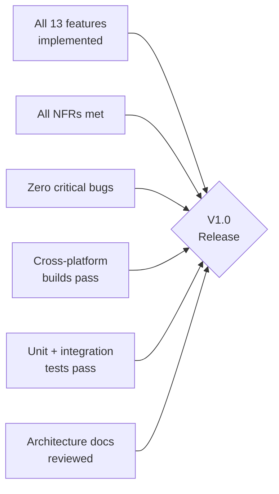

# ORNAS — Product Requirements

> Canonical reference: [ARCHITECTURE_FINAL.md](../ARCHITECTURE_FINAL.md)

---

## 1. User Personas

| Persona | Profile | Pain Points | Key Needs |
|---------|---------|-------------|-----------|
| **Developer (Alex)** | Full-stack dev, copies code snippets, URLs, JSON, SQL daily. Uses 3+ monitors. | Loses track of copied code. Re-copies from browser history. Existing tools are bloated or cloud-only. | Instant search, category detection (code vs URL), keyboard-first UX, offline-only. |
| **Designer (Maya)** | UI/UX designer, copies hex colors, image assets, text copy between Figma/browser. | Can't recall which color code she copied 10 minutes ago. Images lost after next copy. | Image clipboard support, visual preview panel, favorites for reusable snippets. |
| **Writer (Sam)** | Content writer, copies paragraphs, URLs, quotes between docs and CMS. | Accidentally overwrites important clipboard. Needs to compare copied text. | Rich text preview, large text handling, pin important items, duplicate detection. |
| **Student (Priya)** | Research student, copies citations, code samples, notes across many tabs. | Can't manage 50+ daily copies across research sessions. No organization. | Searchable history, category filtering, quick copy via keyboard shortcuts. |

---

## 2. User Stories — V1.0 Features

### Feature 1: Clipboard Monitoring + History

| Story ID | User Story | Acceptance Criteria | Persona |
|----------|-----------|---------------------|---------|
| US-1.1 | As a user, I want every clipboard copy to be automatically captured so I never lose copied content. | Captures text, rich text, and image clipboard events within <20ms. | All |
| US-1.2 | As a user, I want clipboard history persisted across app restarts. | History survives app quit + relaunch. SQLite-backed. | All |
| US-1.3 | As a user, I want to exclude specific apps from clipboard recording. | Exclusion list in Settings. Excluded app copies are silently ignored. | Alex |

### Feature 2: FTS5 Instant Search

| Story ID | User Story | Acceptance Criteria | Persona |
|----------|-----------|---------------------|---------|
| US-2.1 | As a user, I want to search my clipboard history by content. | FTS5 search returns results in <50ms on 10k items. | All |
| US-2.2 | As a user, I want prefix matching as I type. | Typing `"jso"` matches items containing `"json"`. 150ms debounce. | Alex |

### Feature 3: Smart Categorization

| Story ID | User Story | Acceptance Criteria | Persona |
|----------|-----------|---------------------|---------|
| US-3.1 | As a user, I want copied content auto-categorized (URL, code, email, etc.). | 16+ content types detected. First-match regex pipeline. | All |
| US-3.2 | As a user, I want to filter history by category. | Sidebar filters: Text, Code, URLs, Images, etc. | Alex, Priya |

### Feature 4: Duplicate Detection

| Story ID | User Story | Acceptance Criteria | Persona |
|----------|-----------|---------------------|---------|
| US-4.1 | As a user, I don't want duplicate items cluttering my history. | xxHash64 dedup. Duplicate bumps `updated_at` on existing item; no new row. | Sam, Priya |

### Feature 5: Favorites

| Story ID | User Story | Acceptance Criteria | Persona |
|----------|-----------|---------------------|---------|
| US-5.1 | As a user, I want to star items I use frequently. | `Ctrl+F` toggles `is_favorite`. Favorites survive pruning. | Maya, Sam |

### Feature 6: Pinned Items

| Story ID | User Story | Acceptance Criteria | Persona |
|----------|-----------|---------------------|---------|
| US-6.1 | As a user, I want to pin items to keep them at the top of my list. | Pinned items always appear above unpinned. Survive pruning. | Sam |

### Feature 7: Quick Preview Panel

| Story ID | User Story | Acceptance Criteria | Persona |
|----------|-----------|---------------------|---------|
| US-7.1 | As a user, I want to preview the full content of a clip without copying it. | `Space` toggles preview panel. Shows full text, image, or metadata. | Maya, Sam |

### Feature 8: Image Clipboard Support

| Story ID | User Story | Acceptance Criteria | Persona |
|----------|-----------|---------------------|---------|
| US-8.1 | As a user, I want screenshots/images I copy to be captured and displayed. | Images saved to `images/` dir. Displayed as thumbnails in list, full in preview. Max 10MB. | Maya |

### Feature 9: Global Search Window

| Story ID | User Story | Acceptance Criteria | Persona |
|----------|-----------|---------------------|---------|
| US-9.1 | As a user, I want a Raycast-style popup to search and paste from anywhere. | `Ctrl+Shift+V` opens floating search. `Enter` copies + closes. Read-only capability. | Alex, Priya |

### Feature 10: Command Palette

| Story ID | User Story | Acceptance Criteria | Persona |
|----------|-----------|---------------------|---------|
| US-10.1 | As a user, I want a VS Code-style command palette for quick actions. | `Ctrl+Shift+P` opens palette. Fuzzy search over commands. | Alex |

### Feature 11: Keyboard Shortcuts

| Story ID | User Story | Acceptance Criteria | Persona |
|----------|-----------|---------------------|---------|
| US-11.1 | As a user, I want every action reachable by keyboard. | Full keybind map per §14 of ARCHITECTURE_FINAL.md. `1`–`9` quick-copy. | Alex, Priya |

### Feature 12: Dark Mode + Light Mode

| Story ID | User Story | Acceptance Criteria | Persona |
|----------|-----------|---------------------|---------|
| US-12.1 | As a user, I want to switch between dark and light themes. | `Ctrl+Shift+D` toggle. Persisted in settings table. System detection on first launch. | All |

### Feature 13: Settings

| Story ID | User Story | Acceptance Criteria | Persona |
|----------|-----------|---------------------|---------|
| US-13.1 | As a user, I want to configure retention, theme, hotkey, and exclusions. | Settings panel with configurable values per §10 of ARCHITECTURE_FINAL.md. | All |

---

## 3. Non-Functional Requirements

| ID | Category | Requirement | Target | Measurement |
|----|----------|-------------|--------|-------------|
| NFR-1 | **Performance** | Cold startup time | < 2 seconds | Timer from process start to first paint |
| NFR-2 | **Performance** | Warm startup time | < 500ms | Process cached by OS |
| NFR-3 | **Performance** | Search latency (10k items) | < 50ms | FTS5 MATCH + IPC round-trip |
| NFR-4 | **Performance** | Search latency (100k items) | < 100ms | FTS5 + fuzzy re-rank |
| NFR-5 | **Performance** | Clipboard capture latency | < 20ms | Event → persisted in DB |
| NFR-6 | **Performance** | List scroll framerate | 60 FPS | TanStack Virtual + React.memo |
| NFR-7 | **Memory** | Idle memory usage | < 150 MB | RSS reported by OS |
| NFR-8 | **Memory** | Active memory usage | < 250 MB | During search + preview |
| NFR-9 | **Size** | Binary size | < 15 MB | Tauri + bundled SQLite |
| NFR-10 | **Privacy** | Network access | Zero | No telemetry, no cloud, no analytics |
| NFR-11 | **Privacy** | Data locality | 100% local | SQLite file + image directory on disk |
| NFR-12 | **Reliability** | Data persistence | Crash-safe | WAL journal mode, `synchronous = NORMAL` |
| NFR-13 | **Compatibility** | OS support | Win 10+, macOS 12+, Ubuntu 22.04+ | Per §16 compatibility matrix |
| NFR-14 | **Accessibility** | Keyboard navigation | Full coverage | Every action reachable without mouse |
| NFR-15 | **Maintainability** | Rust file size limit | < 300 lines | Code review enforcement |
| NFR-16 | **Maintainability** | React component size limit | < 150 lines | Extract logic into hooks |

---

## 4. Success Criteria

### Launch Gate (V1.0 Release)

### Quantitative Success Metrics

| Metric | Target | How Measured |
|--------|--------|-------------|
| Startup time | < 1.1s (50th percentile) | Instrumented timer in startup sequence |
| Memory idle | < 100 MB (typical) | RSS monitoring during development |
| Search p95 | < 30ms on 10k items | Benchmark test with seeded database |
| Clipboard capture p95 | < 15ms | Instrumented pipeline timing |
| Binary size | < 12 MB | CI build artifact size check |
| DB size (90d medium user) | < 50 MB | Growth projection validation |
| Crash rate | 0 during normal use | Manual QA + structured logging |

### Qualitative Success Criteria

| Criterion | Validation |
|-----------|-----------|
| A new contributor understands the codebase in one afternoon | Code walkthrough with fresh developer |
| Every action reachable via keyboard without reading docs | Keyboard-only usability test |
| App feels instant — no perceived lag on any action | Manual UX testing, no spinner visible during normal use |
| Privacy-first — zero network requests confirmed | `tcpdump` / Wireshark verification during full feature exercise |
