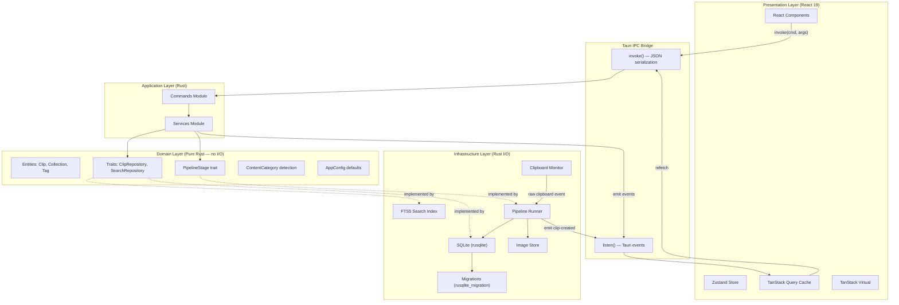
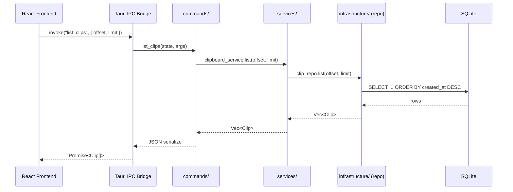
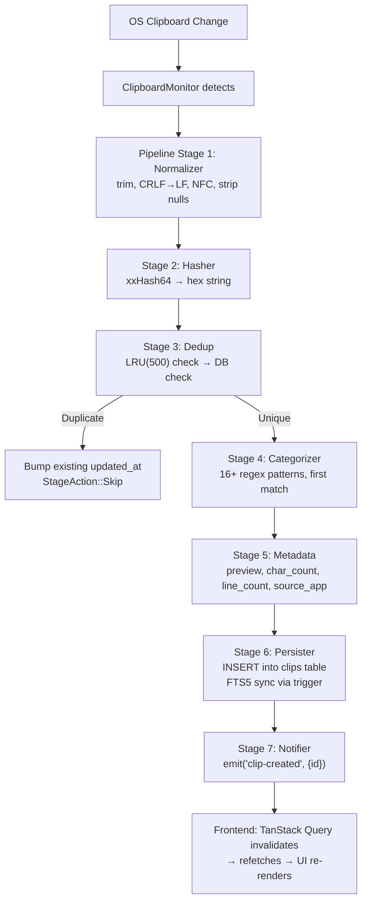
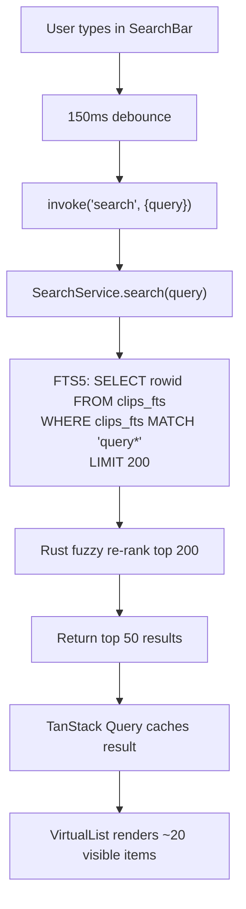
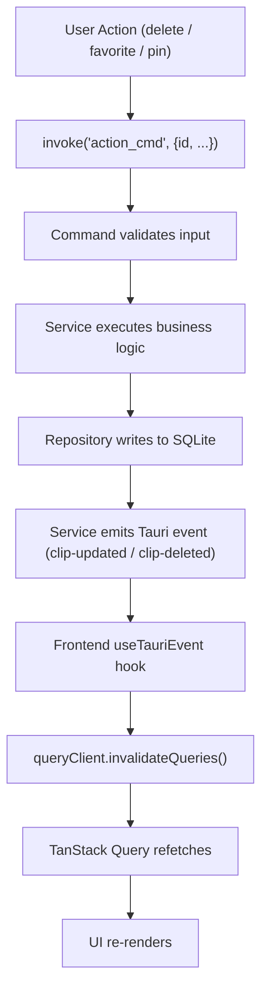
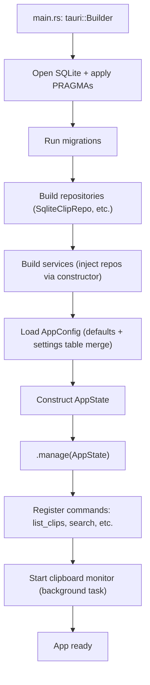

# ORNAS — System Architecture

> Canonical reference: [ARCHITECTURE_FINAL.md](../ARCHITECTURE_FINAL.md)

---

## 1. System Overview Diagram



---

## 2. Clean Architecture Layers

### Dependency Rule

> Dependencies point **inward only**: Infrastructure → Domain ← Application.
> Domain depends on **nothing external** (std lib only).

```mermaid
graph LR
    subgraph Outer["Infrastructure"]
        direction TB
        I1[database/]
        I2[clipboard/]
        I3[pipeline/]
        I4[image_store.rs]
    end

    subgraph Middle["Application"]
        direction TB
        M1[commands/]
        M2[services/]
    end

    subgraph Inner["Domain"]
        direction TB
        D1["entities (clip, tag, collection)"]
        D2["traits (repository definitions)"]
        D3["pipeline trait"]
        D4["category detection"]
        D5["config defaults"]
    end

    Outer -->|"implements traits from"| Inner
    Middle -->|"uses traits from"| Inner
    Middle -.x|"NEVER imports"| Outer
```

### Layer Responsibilities

| Layer | Location | Responsibilities | Knows About | Does NOT Know About |
|-------|----------|-----------------|-------------|---------------------|
| **Presentation** | `src/` (React) | Render UI, manage side effects via hooks | Tauri IPC commands (by name), shared TS types | Rust internals, SQLite, domain |
| **Application** | `src-tauri/src/commands/` + `services/` | Validate input, call services, orchestrate domain logic | Domain traits, domain entities | SQLite, clipboard-rs, filesystem |
| **Domain** | `src-tauri/src/domain/` | Define entities, traits, pure business rules | Nothing external (std lib only) | Everything else |
| **Infrastructure** | `src-tauri/src/infrastructure/` | Implement domain traits using real I/O | Domain traits (to implement them) | Commands, services |

### Module Inventory

| Module | Layer | File | One-Sentence Purpose |
|--------|-------|------|---------------------|
| `commands::clipboard` | Application | `commands/clipboard.rs` | Thin IPC handler: list, get, delete, favorite, pin |
| `commands::search` | Application | `commands/search.rs` | Thin IPC handler: search, suggest |
| `commands::settings` | Application | `commands/settings.rs` | Thin IPC handler: get_all, set, get |
| `services::clipboard_service` | Application | `services/clipboard_service.rs` | CRUD orchestration, pruning logic |
| `services::search_service` | Application | `services/search_service.rs` | FTS5 query + fuzzy re-rank |
| `services::settings_service` | Application | `services/settings_service.rs` | Default merging, validation |
| `domain::clip` | Domain | `domain/clip.rs` | `Clip`, `NewClip`, `ClipUpdate` structs |
| `domain::traits` | Domain | `domain/traits.rs` | Repository trait definitions |
| `domain::pipeline` | Domain | `domain/pipeline.rs` | `PipelineStage` trait + `StageAction` |
| `domain::category` | Domain | `domain/category.rs` | `ContentCategory` enum + detection fns |
| `infrastructure::database` | Infrastructure | `infrastructure/database/` | SQLite repos, connection, migrations |
| `infrastructure::clipboard` | Infrastructure | `infrastructure/clipboard/` | Monitor + native/Wayland adapters |
| `infrastructure::pipeline` | Infrastructure | `infrastructure/pipeline/` | 7-stage runner + stage implementations |

---

## 3. IPC Patterns

### Command → Response Flow



### Event Emission Pattern

| Event | Emitter | Payload | Consumer |
|-------|---------|---------|----------|
| `clip-created` | Notifier pipeline stage | `{ id: i64 }` | `useClipboardItems` → `invalidateQueries` |
| `clip-deleted` | `ClipboardService` | `{ id: i64 }` | `useClipboardItems` → `invalidateQueries` |
| `clip-updated` | `ClipboardService` | `{ id: i64 }` | `useClipboardItems` → `invalidateQueries` |
| `settings-changed` | `SettingsService` | `{ key: String }` | Settings hooks → `invalidateQueries` |

---

## 4. Data Flow — Clipboard Capture



---

## 5. Data Flow — Search



---

## 6. Data Flow — User Actions



---

## 7. AppState — Dependency Injection

```rust
/// Defined in state.rs — constructed once during startup.
/// Passed to all Tauri commands via Tauri's managed state.
pub struct AppState {
    pub clipboard_service: ClipboardService,
    pub search_service: SearchService,
    pub settings_service: SettingsService,
    pub config: AppConfig,
    pub app_handle: AppHandle,
}
```

### Construction Sequence



### Why No DI Container

Rust constructors are explicit and type-safe. A DI framework adds indirection without benefit for this project size. Each service takes its dependencies as constructor parameters — simple, testable, debuggable. See ARCHITECTURE_FINAL.md §18.
