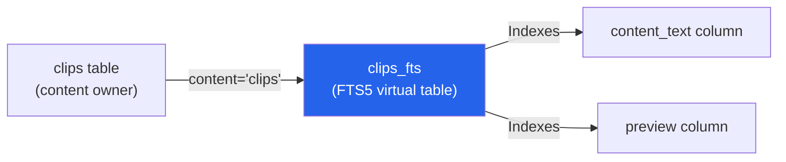
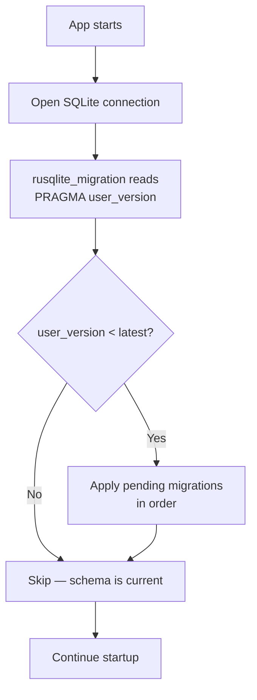
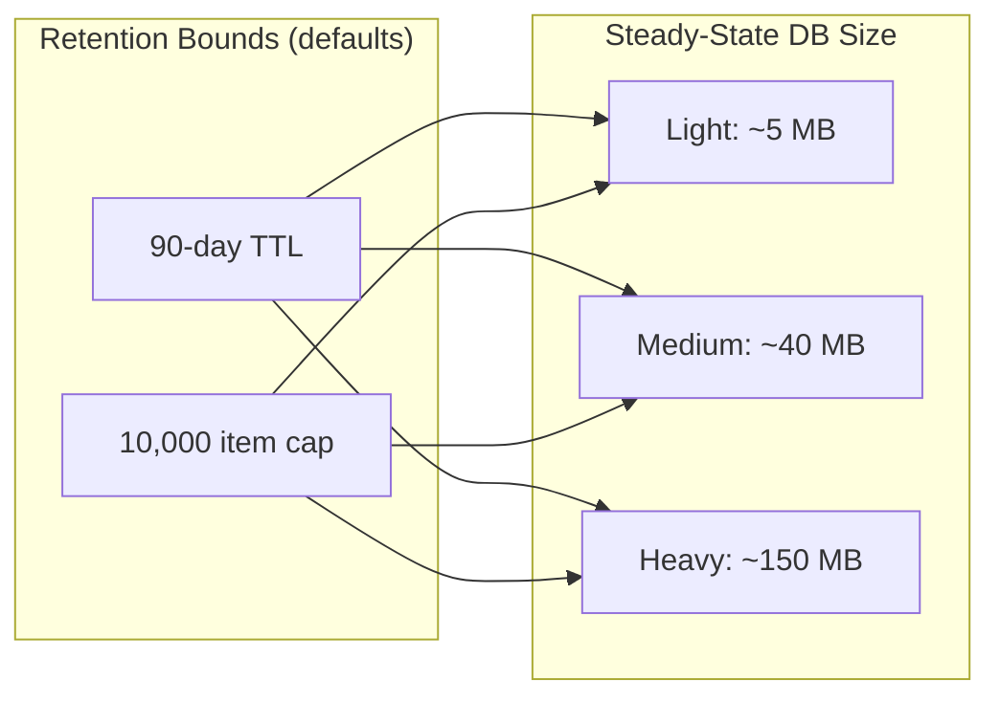

# ORNAS — Database Design

> Canonical reference: [ARCHITECTURE_FINAL.md](../ARCHITECTURE_FINAL.md)

---

## 1. Design Decisions

### Primary Key Strategy: `INTEGER PRIMARY KEY` (no AUTOINCREMENT)

All tables use `INTEGER PRIMARY KEY` without `AUTOINCREMENT`. This aliases the SQLite `rowid` directly, avoiding the `sqlite_sequence` overhead table. ID reuse is only theoretically possible at `2^63` wraparound (~9.2 quintillion entries) — irrelevant for a clipboard manager. See ARCHITECTURE_FINAL.md §9 for full rationale.

### Timestamp Strategy: `INTEGER` Unix Epoch Seconds

All timestamps are stored as `INTEGER` Unix epoch seconds via `DEFAULT (unixepoch())`. This provides 8-byte storage (vs ~27 bytes for ISO-8601 text), integer comparison for sorting (~3× faster), and efficient range queries. The frontend formats all timestamps regardless of storage format. Second precision is sufficient — the auto-incrementing `id` serves as a natural tiebreaker. See ARCHITECTURE_FINAL.md §9.

---

## 2. Schema — Column Explanations

### `clips` Table

| Column | Type | Constraints | Purpose |
|--------|------|------------|---------|
| `id` | `INTEGER` | `PRIMARY KEY` | Row alias (no AUTOINCREMENT). Auto-assigned by SQLite. |
| `content_text` | `TEXT` | Nullable | Raw text content. NULL for image-only clips. |
| `content_html` | `TEXT` | Nullable | HTML representation of rich text. NULL for plain text/images. |
| `content_rtf` | `TEXT` | Nullable | RTF representation. NULL for plain text/images. |
| `image_path` | `TEXT` | Nullable | Relative path to saved image in `images/` dir. NULL for text clips. |
| `content_type` | `TEXT` | `NOT NULL`, `CHECK IN ('text','image','rich_text')` | Broad content classification. Determines rendering strategy. |
| `category` | `TEXT` | `NOT NULL DEFAULT 'plain_text'` | Auto-detected category (e.g., `url`, `json`, `python`). Set by categorizer pipeline stage. |
| `source_app` | `TEXT` | Nullable | Application name the content was copied from. Platform-dependent. |
| `content_hash` | `TEXT` | `NOT NULL` | xxHash64 hex digest of normalized content. Used for deduplication. |
| `preview` | `TEXT` | Nullable | First 200 chars of content. Used in list rendering and FTS5 indexing. |
| `char_count` | `INTEGER` | `NOT NULL DEFAULT 0` | Character count of `content_text`. Display metadata. |
| `line_count` | `INTEGER` | `NOT NULL DEFAULT 0` | Line count of `content_text`. Display metadata. |
| `is_favorite` | `INTEGER` | `NOT NULL DEFAULT 0` | Boolean flag (0/1). Favorites survive retention pruning. |
| `is_pinned` | `INTEGER` | `NOT NULL DEFAULT 0` | Boolean flag (0/1). Pinned items stay at top. Survive pruning. |
| `created_at` | `INTEGER` | `NOT NULL DEFAULT (unixepoch())` | Unix epoch seconds when clip was first captured. |
| `updated_at` | `INTEGER` | `NOT NULL DEFAULT (unixepoch())` | Unix epoch seconds of last modification (dedup bump, favorite toggle, etc.). |

### `collections` Table (Schema ready — UI deferred to V1.1)

| Column | Type | Constraints | Purpose |
|--------|------|------------|---------|
| `id` | `INTEGER` | `PRIMARY KEY` | Row alias. |
| `name` | `TEXT` | `NOT NULL` | User-defined collection name. |
| `icon` | `TEXT` | Nullable | Optional emoji or icon identifier. |
| `color` | `TEXT` | Nullable | Hex color for UI display. |
| `sort_order` | `INTEGER` | `NOT NULL DEFAULT 0` | User-defined ordering of collections. |
| `created_at` | `INTEGER` | `NOT NULL DEFAULT (unixepoch())` | Unix epoch seconds. |

### `clip_collections` Table (Junction — M:N)

| Column | Type | Constraints | Purpose |
|--------|------|------------|---------|
| `clip_id` | `INTEGER` | `NOT NULL`, `FK → clips(id) ON DELETE CASCADE` | References the clip. |
| `collection_id` | `INTEGER` | `NOT NULL`, `FK → collections(id) ON DELETE CASCADE` | References the collection. |
| — | — | `PRIMARY KEY (clip_id, collection_id)` | Composite PK prevents duplicates. |

### `tags` Table (Schema ready — UI deferred to V1.1)

| Column | Type | Constraints | Purpose |
|--------|------|------------|---------|
| `id` | `INTEGER` | `PRIMARY KEY` | Row alias. |
| `name` | `TEXT` | `NOT NULL UNIQUE` | Tag label. Unique constraint prevents duplicates. |
| `color` | `TEXT` | Nullable | Hex color for badge display. |

### `clip_tags` Table (Junction — M:N)

| Column | Type | Constraints | Purpose |
|--------|------|------------|---------|
| `clip_id` | `INTEGER` | `NOT NULL`, `FK → clips(id) ON DELETE CASCADE` | References the clip. |
| `tag_id` | `INTEGER` | `NOT NULL`, `FK → tags(id) ON DELETE CASCADE` | References the tag. |
| — | — | `PRIMARY KEY (clip_id, tag_id)` | Composite PK prevents duplicates. |

### `settings` Table

| Column | Type | Constraints | Purpose |
|--------|------|------------|---------|
| `key` | `TEXT` | `PRIMARY KEY` | Setting identifier (e.g., `retention_days`, `theme`). |
| `value` | `TEXT` | `NOT NULL` | Setting value, stored as text. Parsed by SettingsService. |
| `updated_at` | `INTEGER` | `NOT NULL DEFAULT (unixepoch())` | Unix epoch seconds of last change. |

---

## 3. FTS5 External Content Tables

### Architecture

The FTS5 table is an **external content** table (`content='clips'`), meaning it does not store a copy of the indexed text. It references the `clips` table by `content_rowid='id'`. This avoids data duplication and keeps the FTS index at ~30% of indexed text size.

### Configuration

| FTS5 Option | Value | Purpose |
|-------------|-------|---------|
| `content` | `'clips'` | External content — reads from `clips` table |
| `content_rowid` | `'id'` | Maps FTS rowid to `clips.id` |
| `tokenize` | `'unicode61 remove_diacritics 2'` | Unicode-aware tokenizer. `remove_diacritics 2` normalizes accented characters for search. |
| `prefix` | `'2,3'` | Pre-built prefix indexes for 2 and 3-char prefixes. Enables fast prefix queries (e.g., `jso*`). |

### Trigger-Based Sync

Since external content FTS tables don't auto-sync, three triggers maintain consistency:

| Trigger | Fires On | SQL Action |
|---------|---------|------------|
| `clips_fts_ai` | `AFTER INSERT ON clips` | `INSERT INTO clips_fts(rowid, content_text, preview) VALUES (new.id, ...)` |
| `clips_fts_ad` | `AFTER DELETE ON clips` | `INSERT INTO clips_fts(clips_fts, rowid, ...) VALUES ('delete', old.id, ...)` |
| `clips_fts_au` | `AFTER UPDATE OF content_text, preview ON clips` | Delete old entry + insert new entry (two-step update) |

> **Note:** The `'delete'` command is FTS5's mechanism for removing entries from external content tables. It is not a standard SQL DELETE.

---

## 4. Index → Query Mapping

| Index | Definition | Query It Serves | V1.0 Usage |
|-------|-----------|----------------|-----------|
| `idx_clips_created` | `ON clips(created_at DESC)` | `SELECT ... ORDER BY created_at DESC LIMIT ?` | Main list, paginated loading |
| `idx_clips_hash` | `ON clips(content_hash)` | `SELECT id FROM clips WHERE content_hash = ?` | Dedup check in pipeline stage 3 |
| `idx_clips_category` | `ON clips(category)` | `SELECT ... WHERE category = ? ORDER BY ...` | Sidebar category filter |
| `idx_clips_favorites` | `ON clips(created_at DESC) WHERE is_favorite = 1` | `SELECT ... WHERE is_favorite = 1 ORDER BY created_at DESC` | Favorites view (partial index) |
| `idx_clips_pinned` | `ON clips(created_at DESC) WHERE is_pinned = 1` | `SELECT ... WHERE is_pinned = 1 ORDER BY created_at DESC` | Pinned items section (partial index) |

> **Removed:** `idx_clips_type` on `content_type` — category filter is sufficient. One fewer index = faster writes.

---

## 5. Migration Strategy

### Tool: `rusqlite_migration`

Migrations are stored in `src-tauri/migrations/` as numbered SQL files. The `rusqlite_migration` crate tracks applied migrations via SQLite's `PRAGMA user_version`.

### Migration Rules

| Rule | Rationale |
|------|-----------|
| One migration per release | Simple versioning, predictable rollout |
| SQL only — no Rust logic in migrations | Migrations must be reviewable as plain SQL |
| Forward-only — no down migrations | Desktop app. Users don't rollback. Simplifies migration code. |
| Schema changes in new migration files only | Never modify existing migration files after release |
| V1.0 uses a single migration: `001_initial.sql` | Contains complete schema: all tables, indexes, triggers, FTS5 |

---

## 6. PRAGMA Configuration

### One-Time (Database Creation)

| PRAGMA | Value | When | Rationale |
|--------|-------|------|-----------|
| `auto_vacuum` | `NONE` | Before any tables created | Best write performance. Freed pages reused by new inserts. Manual VACUUM available in Settings. |

### Per-Connection (Every Open)

| PRAGMA | Value | Rationale |
|--------|-------|-----------|
| `journal_mode` | `WAL` | Concurrent reads during writes. Clipboard writes don't block search. |
| `synchronous` | `NORMAL` | Safe with WAL. ~5× faster than `FULL`. |
| `busy_timeout` | `5000` | 5s wait on lock instead of instant `SQLITE_BUSY`. |
| `foreign_keys` | `ON` | Enforce referential integrity (OFF by default in SQLite). |
| `cache_size` | `-16000` | 16 MB page cache. Negative = KB. |
| `mmap_size` | `268435456` | 256 MB virtual mapping. OS manages resident pages. |
| `temp_store` | `MEMORY` | Temp tables in RAM for faster sort/join buffers. |

---

## 7. Maintenance Schedule

| Task | Trigger | SQL / Action |
|------|---------|-------------|
| **Pruning** | Startup + every 60 min | `DELETE FROM clips WHERE is_favorite = 0 AND is_pinned = 0 AND created_at < unixepoch() - (retention_days * 86400)` |
| **FTS5 optimize** | App shutdown | `INSERT INTO clips_fts(clips_fts) VALUES('optimize');` |
| **PRAGMA optimize** | App shutdown | `PRAGMA optimize;` — lets SQLite re-analyze tables |
| **WAL checkpoint** | Every 30 min idle | `PRAGMA wal_checkpoint(PASSIVE);` — non-blocking |
| **Manual VACUUM** | User-triggered (Settings → Advanced) | `VACUUM;` — rewrites DB file, reclaims free space |

---

## 8. Growth Projections

| Scenario | Copies/Day | Avg Text Size | Images/Day | DB at 30 Days | DB at 90 Days | DB at 365 Days |
|----------|-----------|--------------|-----------|--------------|--------------|---------------|
| **Light** | 50 | ~1 KB | 2 | ~2 MB | ~5 MB | ~20 MB |
| **Medium** | 200 | ~2 KB | 10 | ~13 MB | ~40 MB | ~160 MB |
| **Heavy** | 500 | ~3 KB | 30 | ~50 MB | ~150 MB | ~600 MB |

> **Notes:**
> - Image files are stored externally in `images/` directory and are **not** counted in DB size.
> - FTS5 index adds ~30% overhead to indexed text columns.
> - Default 90-day retention + 10,000-item cap keeps the database bounded for all scenarios.
> - With default retention, the "Heavy" scenario stabilizes at ~150 MB.

