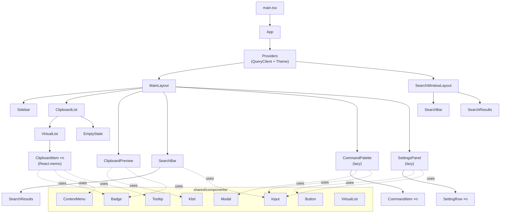
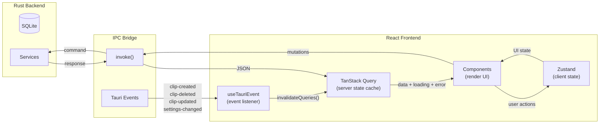

# ORNAS — Component Tree

> Canonical reference: [ARCHITECTURE_FINAL.md](../ARCHITECTURE_FINAL.md)

---

## 1. Component Hierarchy



---

## 2. Component Props Interfaces

```typescript
// ── Feature: Clipboard ──────────────────────────────────

interface ClipboardListProps {
  category?: string;          // Active category filter
  favoritesOnly?: boolean;    // Show only starred items
  pinnedOnly?: boolean;       // Show only pinned items
}

interface ClipboardItemProps {
  clip: Clip;                 // Clip entity from backend
  isSelected: boolean;        // Keyboard navigation highlight
  onSelect: (id: number) => void;
  onCopy: (id: number) => void;
  onDelete: (id: number) => void;
  onToggleFavorite: (id: number) => void;
  onTogglePin: (id: number) => void;
}

interface ClipboardPreviewProps {
  clip: Clip | null;          // Currently selected clip
  isOpen: boolean;            // Panel visibility
}

// ── Feature: Search ─────────────────────────────────────

interface SearchBarProps {
  value: string;
  onChange: (query: string) => void;
  onClear: () => void;
  autoFocus?: boolean;
}

interface SearchResultsProps {
  results: Clip[];
  isLoading: boolean;
  selectedIndex: number;
  onSelect: (id: number) => void;
}

// ── Feature: Command Palette ────────────────────────────

interface CommandPaletteProps {
  isOpen: boolean;
  onClose: () => void;
}

interface CommandItemProps {
  command: Command;
  isSelected: boolean;
  onExecute: () => void;
}

// ── Feature: Settings ───────────────────────────────────

interface SettingRowProps {
  label: string;
  description?: string;
  children: React.ReactNode;  // Input, select, toggle control
}

// ── Shared Types ────────────────────────────────────────

interface Clip {
  id: number;
  content_text: string | null;
  content_html: string | null;
  image_path: string | null;
  content_type: "text" | "image" | "rich_text";
  category: string;
  source_app: string | null;
  preview: string | null;
  char_count: number;
  line_count: number;
  is_favorite: boolean;
  is_pinned: boolean;
  created_at: number;         // Unix epoch seconds
  updated_at: number;         // Unix epoch seconds
}
```

---

## 3. Data Flow



### State Ownership

| State Type | Owner | Examples |
|-----------|-------|---------|
| **Server state** | TanStack Query | Clip list, search results, settings values |
| **UI state** | Zustand | Selected item ID, sidebar open/closed, active view, theme |
| **Navigation state** | Zustand (`navigation-store`) | Keyboard focus index, active panel |
| **Derived state** | Component-local | Formatted dates, truncated previews |

### TanStack Query Key Factory

```typescript
// features/clipboard/api/keys.ts
export const clipboardKeys = {
  all:       () => ["clips"] as const,
  lists:     () => [...clipboardKeys.all(), "list"] as const,
  list:      (filters: ClipFilters) => [...clipboardKeys.lists(), filters] as const,
  details:   () => [...clipboardKeys.all(), "detail"] as const,
  detail:    (id: number) => [...clipboardKeys.details(), id] as const,
};
```

---

## 4. Rendering Optimizations

| Technique | Applied To | Purpose |
|-----------|-----------|---------|
| `React.memo` | `ClipboardItem` | Prevent re-render when props unchanged (list has 100k+ items) |
| TanStack Virtual | `ClipboardList` | Virtualize DOM — only render ~20 visible items at 60 FPS |
| `staleTime` | All TanStack Query hooks | Prevent redundant IPC re-fetches within cache window |
| `IntersectionObserver` | Image thumbnails | Lazy-load images only when scrolled into viewport |
| Lazy loading | `SettingsPanel`, `CommandPalette`, `SearchWindowLayout` | Code-split — not loaded until first use |
| Query deduplication | TanStack Query (built-in) | Multiple components using same query key share one IPC call |

### Virtual Scrolling Architecture

```
┌─────────────────────────────────────────┐
│  ClipboardList                           │
│  ┌─────────────────────────────────────┐ │
│  │  VirtualList (TanStack Virtual)     │ │
│  │  ┌─────────────────────────────┐    │ │
│  │  │ Overscan (5 items above)    │    │ │
│  │  ├─────────────────────────────┤    │ │
│  │  │ Visible items (~20)         │    │ │
│  │  │  ClipboardItem (memo)       │    │ │
│  │  │  ClipboardItem (memo)       │    │ │
│  │  │  ClipboardItem (memo)       │    │ │
│  │  │  ...                        │    │ │
│  │  ├─────────────────────────────┤    │ │
│  │  │ Overscan (5 items below)    │    │ │
│  │  └─────────────────────────────┘    │ │
│  │  Total items: 100,000               │ │
│  │  DOM nodes: ~30                     │ │
│  └─────────────────────────────────────┘ │
└─────────────────────────────────────────┘
```

---

## 5. Component Responsibility Matrix

| Component | Responsibility | Data Source | Hooks Used |
|-----------|---------------|-------------|------------|
| `App` | Root providers + layout routing | — | — |
| `MainLayout` | Three-panel layout (sidebar + list + preview) | — | `useHotkey` |
| `SearchWindowLayout` | Floating search popup | — | `useHotkey` |
| `ClipboardList` | Paginated, virtualized clip list | TanStack Query | `useClipboardItems` |
| `ClipboardItem` | Single row: preview text, badges, actions | Props (memo) | `useClipboardActions` |
| `ClipboardPreview` | Full content view of selected clip | TanStack Query | — |
| `EmptyState` | First-run / empty filter message | — | — |
| `SearchBar` | Debounced search input | Zustand (query) | `useDebounce` |
| `SearchResults` | Filtered search result list | TanStack Query | `useSearch` |
| `CommandPalette` | Command search + execution | Local state | `useCommands`, `useHotkey` |
| `SettingsPanel` | Configuration UI | TanStack Query | — |
| `SettingRow` | Single setting: label + control | Props | — |

### Import Rules

| Source | Can Import From | Cannot Import From |
|--------|----------------|-------------------|
| `features/clipboard/` | `shared/`, own submodules | `features/search/`, `features/settings/` internals |
| `features/search/` | `shared/`, own submodules | Other feature internals |
| `shared/` | `shared/` only | Any `features/` module |
| `stores/` | `shared/types/` | `features/`, `shared/components/` |
| `services/` | `shared/types/` | `features/`, `shared/components/` |

> Full folder structure and boundary rules → [ARCHITECTURE_FINAL.md §5](../ARCHITECTURE_FINAL.md#5-final-folder-structure)
