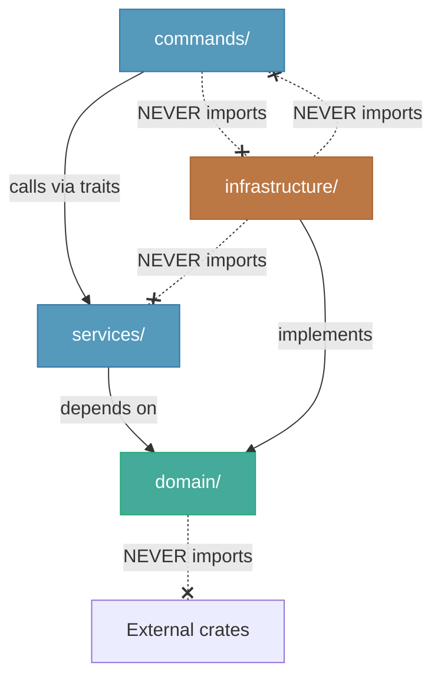
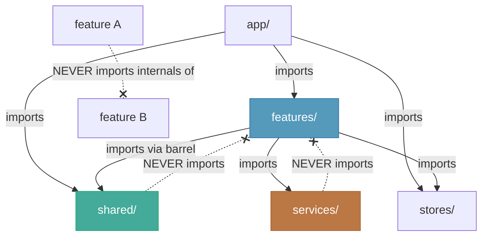

# ORNAS — Folder Structure

> Canonical reference: [ARCHITECTURE_FINAL.md](../ARCHITECTURE_FINAL.md)

---

## 1. Annotated Directory Tree

```
ORNAS/
│
├── docs/                                    # Architecture & design documentation
│   ├── ARCHITECTURE_FINAL.md               # Single source of truth
│   └── architecture/                        # Derived architecture documents
│
├── src-tauri/                               # ═══ RUST BACKEND ═══
│   ├── src/
│   │   ├── commands/                        # ▸ APPLICATION LAYER: Tauri IPC handlers
│   │   │   ├── mod.rs                      #   Module re-exports
│   │   │   ├── clipboard.rs                #   list, get, delete, favorite, pin
│   │   │   ├── search.rs                   #   search, suggest
│   │   │   └── settings.rs                 #   get_all, set, get
│   │   │
│   │   ├── services/                        # ▸ APPLICATION LAYER: Business logic
│   │   │   ├── mod.rs                      #   Module re-exports
│   │   │   ├── clipboard_service.rs        #   CRUD orchestration, pruning
│   │   │   ├── search_service.rs           #   FTS5 query + fuzzy re-rank
│   │   │   └── settings_service.rs         #   Defaults, validation
│   │   │
│   │   ├── domain/                          # ▸ DOMAIN LAYER: Pure business rules
│   │   │   ├── mod.rs                      #   Module re-exports
│   │   │   ├── clip.rs                     #   Clip, NewClip, ClipUpdate structs
│   │   │   ├── collection.rs              #   Collection struct (V1.1 UI)
│   │   │   ├── tag.rs                      #   Tag struct (V1.1 UI)
│   │   │   ├── config.rs                   #   AppConfig struct + defaults
│   │   │   ├── category.rs                 #   ContentCategory enum + detection fns
│   │   │   ├── pipeline.rs                 #   PipelineStage trait + StageAction
│   │   │   └── traits.rs                   #   Repository trait definitions
│   │   │
│   │   ├── infrastructure/                  # ▸ INFRASTRUCTURE LAYER: I/O implementations
│   │   │   ├── mod.rs
│   │   │   ├── database/
│   │   │   │   ├── mod.rs
│   │   │   │   ├── connection.rs           #   Open, PRAGMA config, close
│   │   │   │   ├── migrations.rs           #   rusqlite_migration runner
│   │   │   │   ├── clip_repo.rs            #   impl ClipRepository
│   │   │   │   ├── search_repo.rs          #   impl SearchRepository
│   │   │   │   └── settings_repo.rs        #   impl SettingsRepository
│   │   │   ├── clipboard/
│   │   │   │   ├── mod.rs
│   │   │   │   ├── monitor.rs              #   ClipboardMonitor trait + dispatcher
│   │   │   │   ├── native.rs               #   clipboard-rs (Win/Mac/X11)
│   │   │   │   └── wayland.rs              #   arboard fallback (Wayland)
│   │   │   ├── pipeline/
│   │   │   │   ├── mod.rs
│   │   │   │   ├── runner.rs               #   Sequential stage executor
│   │   │   │   ├── normalizer.rs           #   Stage 1: whitespace, encoding
│   │   │   │   ├── hasher.rs               #   Stage 2: xxHash64
│   │   │   │   ├── dedup.rs                #   Stage 3: LRU + DB check
│   │   │   │   ├── categorizer.rs          #   Stage 4: regex detection
│   │   │   │   ├── metadata.rs             #   Stage 5: preview, counts
│   │   │   │   ├── persister.rs            #   Stage 6: DB insert
│   │   │   │   └── notifier.rs             #   Stage 7: Tauri event
│   │   │   └── image_store.rs              #   Save/load clipboard images
│   │   │
│   │   ├── error.rs                         # AppError enum (thiserror)
│   │   ├── state.rs                         # AppState: DI container
│   │   ├── lib.rs                           # App builder, module tree
│   │   └── main.rs                          # Entry point → lib::run()
│   │
│   ├── migrations/
│   │   └── 001_initial.sql                  # V1.0 schema (single migration)
│   ├── capabilities/
│   │   ├── main-window.json                 # Full access for main window
│   │   └── search-window.json              # Read-only for search popup
│   ├── icons/                               # App icons (all sizes)
│   ├── Cargo.toml                           # Rust dependencies
│   ├── tauri.conf.json                      # Tauri app configuration
│   └── build.rs                             # Tauri build script
│
├── src/                                     # ═══ REACT FRONTEND ═══
│   ├── app/
│   │   ├── App.tsx                          # Root: providers + layout
│   │   └── providers.tsx                    # QueryClient + Zustand + Theme
│   │
│   ├── features/                            # Feature modules (isolated)
│   │   ├── clipboard/
│   │   │   ├── components/                 #   ClipboardList, ClipboardItem,
│   │   │   │                               #   ClipboardPreview, EmptyState
│   │   │   ├── hooks/                      #   useClipboardItems, useClipboardActions
│   │   │   ├── api/                        #   queries.ts, mutations.ts, keys.ts
│   │   │   ├── store.ts                    #   Zustand slice (selected, viewMode)
│   │   │   └── index.ts                    #   Barrel export (public API)
│   │   ├── search/                         #   SearchBar, SearchResults, useSearch
│   │   ├── command-palette/                #   CommandPalette, CommandItem, useCommands
│   │   └── settings/                       #   SettingsPanel, SettingRow
│   │
│   ├── shared/                              # Feature-agnostic shared code
│   │   ├── components/                     #   Button, Input, Modal, Badge,
│   │   │                                   #   Tooltip, ContextMenu, Kbd, VirtualList
│   │   ├── hooks/                          #   useHotkey, useDebounce,
│   │   │                                   #   useTauriEvent, useTheme
│   │   ├── layouts/                        #   MainLayout, SearchWindowLayout
│   │   ├── lib/                            #   utils, constants, cn, formatters
│   │   └── types/                          #   Shared TypeScript types
│   │
│   ├── services/                            # Tauri IPC abstraction layer
│   │   ├── invoke.ts                       #   Type-safe invoke wrapper
│   │   ├── clipboard.ts                    #   Clipboard IPC calls
│   │   ├── search.ts                       #   Search IPC calls
│   │   └── settings.ts                     #   Settings IPC calls
│   │
│   ├── stores/                              # Global Zustand stores
│   │   ├── index.ts                        #   Combined store export
│   │   ├── ui-store.ts                     #   Sidebar, theme, layout
│   │   └── navigation-store.ts             #   Keyboard focus position
│   │
│   ├── styles/
│   │   └── globals.css                      # Tailwind directives + CSS vars
│   │
│   └── main.tsx                             # React entry point
│
├── package.json                             # Frontend dependencies
├── tailwind.config.ts                       # Tailwind configuration
├── tsconfig.json                            # TypeScript configuration
├── vite.config.ts                           # Vite build configuration
├── LICENSE                                  # MIT
├── README.md
└── CONTRIBUTING.md
```

---

## 2. File Naming Conventions

| Context | Convention | Examples |
|---------|-----------|---------|
| Rust source files | `snake_case.rs` | `clip_repo.rs`, `clipboard_service.rs`, `image_store.rs` |
| Rust modules | `snake_case/mod.rs` | `database/mod.rs`, `pipeline/mod.rs` |
| React components | `PascalCase.tsx` | `ClipboardList.tsx`, `SearchBar.tsx`, `EmptyState.tsx` |
| React hooks | `camelCase` with `use` prefix `.ts` | `useClipboardItems.ts`, `useDebounce.ts` |
| API files | `camelCase.ts` | `queries.ts`, `mutations.ts`, `keys.ts` |
| Store files | `kebab-case.ts` | `ui-store.ts`, `navigation-store.ts` |
| Shared utilities | `camelCase.ts` | `utils.ts`, `formatters.ts`, `constants.ts` |
| SQL migrations | `NNN_descriptor.sql` | `001_initial.sql` |
| Config files | Standard names | `Cargo.toml`, `tauri.conf.json`, `tsconfig.json` |

---

## 3. Module Boundary Rules

### Rust Backend



| Rule | Enforcement | Violation Example |
|------|-------------|-------------------|
| `domain/` has zero external crate imports | Code review | `use rusqlite::*` in `domain/clip.rs` ❌ |
| `commands/` never imports `infrastructure/` | Rust module visibility | `use crate::infrastructure::database::*` in commands ❌ |
| `commands/` calls services, not repos directly | Code review | `repo.insert()` called from command handler ❌ |

### React Frontend



| Rule | Enforcement | Violation Example |
|------|-------------|-------------------|
| Feature modules never import other features' internals | Only import from `feature/index.ts` | `import { ClipboardItem } from '../clipboard/components/ClipboardItem'` ❌ |
| `shared/` never imports from `features/` | Shared is feature-agnostic | `import { useClipboardItems } from '../../features/clipboard'` ❌ |
| `services/` is a thin IPC layer | No business logic in services | Complex validation in `services/clipboard.ts` ❌ |

---

## 4. File Size Limits

| Context | Limit | Action When Exceeded |
|---------|-------|---------------------|
| Rust source file | **< 300 lines** | Split into submodules |
| React component | **< 150 lines** | Extract logic into hooks |
| Hook file | **< 200 lines** | Split into focused hooks |
| API file | **< 100 lines** | Split by entity |

---

## 5. Barrel Export Pattern

Each feature module exposes a **public API** via `index.ts`:

```typescript
// features/clipboard/index.ts
export { ClipboardList } from './components/ClipboardList';
export { ClipboardPreview } from './components/ClipboardPreview';
export { useClipboardItems } from './hooks/useClipboardItems';
export { useClipboardActions } from './hooks/useClipboardActions';
// Internal components (ClipboardItem, EmptyState) are NOT exported
```

Other features and `app/` import **only** from the barrel:

```typescript
// ✅ Correct
import { ClipboardList } from '@/features/clipboard';

// ❌ Wrong — reaching into internals
import { ClipboardItem } from '@/features/clipboard/components/ClipboardItem';
```

> Full structural rules and rationale → [ARCHITECTURE_FINAL.md §5](../ARCHITECTURE_FINAL.md#5-final-folder-structure)
