# ORNAS — Development Roadmap

> Canonical reference: [ARCHITECTURE_FINAL.md](../ARCHITECTURE_FINAL.md)

---

## Overview

This document defines the release milestones, feature implementation order,
dependency graph, and release criteria for ORNAS from V1.0 through V3.0.
Every feature listed here traces back to the canonical architecture document.

---

## V1.0 — Core Clipboard Manager

**Goal:** A polished, keyboard-first clipboard history tool.
**Scope:** 13 features. Zero fat.
**Timeline:** Initial release.

### V1.0 Feature Breakdown (Implementation Order)

Features are ordered by dependency — each row can only begin after its
dependencies are complete.

| Phase | # | Feature | Effort | Dependencies | Rust Module | React Feature |
|-------|---|---------|--------|-------------|-------------|---------------|
| **Foundation** | 1 | Clipboard monitoring + history | High | — | `infrastructure/clipboard/` | `features/clipboard/` |
| **Foundation** | 2 | Smart categorization (16+ types) | Medium | #1 | `infrastructure/pipeline/categorizer.rs` | — |
| **Foundation** | 3 | Duplicate detection | Low | #1 | `infrastructure/pipeline/dedup.rs` | — |
| **Pipeline** | 4 | Image clipboard support | Medium | #1 | `infrastructure/image_store.rs` | `ClipboardPreview.tsx` |
| **Search** | 5 | FTS5 instant search | Medium | #1 | `infrastructure/database/search_repo.rs` | `features/search/` |
| **UI Core** | 6 | Quick preview panel | Medium | #1, #2 | — | `ClipboardPreview.tsx` |
| **UI Core** | 7 | Favorites (star/unstar) | Low | #1 | `commands/clipboard.rs` | `ClipboardItem.tsx` |
| **UI Core** | 8 | Pinned items (stay at top) | Low | #1 | `commands/clipboard.rs` | `ClipboardItem.tsx` |
| **Signature UX** | 9 | Global search window (Raycast-style) | High | #5 | — | `SearchWindowLayout.tsx` |
| **Navigation** | 10 | Command palette | Medium | — | — | `features/command-palette/` |
| **Navigation** | 11 | Keyboard shortcuts (full navigation) | Medium | #9, #10 | — | `shared/hooks/useHotkey.ts` |
| **Polish** | 12 | Dark mode + light mode | Low | — | — | `shared/hooks/useTheme.ts` |
| **Polish** | 13 | Settings (retention, theme, hotkey) | Medium | #12 | `commands/settings.rs` | `features/settings/` |

### V1.0 Implementation Phases

```mermaid
gantt
    title V1.0 Implementation Phases
    dateFormat  X
    axisFormat %s

    section Foundation
    Clipboard monitoring + history    :f1, 0, 5
    Smart categorization              :f2, 1, 4
    Duplicate detection               :f3, 1, 3
    Image clipboard support           :f4, 3, 5

    section Search
    FTS5 instant search               :f5, 3, 5

    section UI Core
    Quick preview panel               :f6, 5, 7
    Favorites                         :f7, 5, 6
    Pinned items                      :f8, 5, 6

    section Signature UX
    Global search window              :f9, 5, 8
    Command palette                   :f10, 5, 7

    section Polish
    Keyboard shortcuts                :f11, 7, 9
    Dark/light mode                   :f12, 6, 7
    Settings                          :f13, 7, 9
```

---

## V1.1 — Organization

**Goal:** Collections, tags, and enhanced content rendering.
**Timeline:** Est. 4–6 weeks after V1.0.

| # | Feature | Depends On | Effort |
|---|---------|-----------|--------|
| 14 | Collections UI (create, manage, assign) | Schema ready in V1.0 | Medium |
| 15 | Tags UI (create, assign, filter) | Schema ready in V1.0 | Medium |
| 16 | Syntax highlighting in preview | Add `shiki` or `prism` | Medium |
| 17 | File clipboard support | clipboard-rs file list | High |
| 18 | Import / export (JSON format) | `ClipRepository::list_all` | Medium |

---

## V1.2 — Productivity

**Goal:** Power-user features and data safety.
**Timeline:** Est. 4–6 weeks after V1.1.

| # | Feature | Depends On | Effort |
|---|---------|-----------|--------|
| 19 | Snippet manager (CRUD + shortcuts) | New `snippets` table | High |
| 20 | Timeline view | New visualization component | Medium |
| 21 | Backup / restore (automated) | SQLite backup API | Medium |
| 22 | Sensitive item auto-expiry | New `expires_at` column | Low |
| 23 | Encrypted favorites storage | OS keyring + SQLCipher | High |

---

## V2.0 — Extensibility

**Goal:** Plugin system with WASM sandboxing.
**Timeline:** Est. 8–12 weeks after V1.2.

| # | Feature | Depends On | Effort |
|---|---------|-----------|--------|
| 24 | Plugin SDK (WASM sandbox) | wasmtime, manifest, hooks | Very High |
| 25 | Event bus (broadcast channel) | `tokio::broadcast` | Medium |
| 26 | Plugin permissions model | Capability-based manifest | High |
| 27 | Plugin UI extensions | WebView panels for plugins | High |

---

## V3.0 — Platform

**Goal:** AI, collaboration, and platform features.
**Timeline:** Future.

| # | Feature | Depends On | Effort |
|---|---------|-----------|--------|
| 28 | Clipboard sync (P2P or relay) | Sync engine, conflict resolution | Very High |
| 29 | OCR (image → text) | Tesseract or similar | High |
| 30 | Local AI categorization (Ollama) | HTTP client, pipeline stage | High |
| 31 | Quick Notes | New entity + feature module | Medium |
| 32 | Automation / workflows | Event subscriptions + actions | Very High |

---

## Feature Dependency Graph

```mermaid
graph TD
    subgraph "V1.0 — Core"
        F1["#1 Clipboard Monitoring"]
        F2["#2 Categorization"]
        F3["#3 Duplicate Detection"]
        F4["#4 Image Support"]
        F5["#5 FTS5 Search"]
        F6["#6 Preview Panel"]
        F7["#7 Favorites"]
        F8["#8 Pinned Items"]
        F9["#9 Global Search Window"]
        F10["#10 Command Palette"]
        F11["#11 Keyboard Shortcuts"]
        F12["#12 Dark/Light Mode"]
        F13["#13 Settings"]
    end

    subgraph "V1.1 — Organization"
        F14["#14 Collections UI"]
        F15["#15 Tags UI"]
        F16["#16 Syntax Highlighting"]
        F17["#17 File Clipboard"]
        F18["#18 Import/Export"]
    end

    subgraph "V1.2 — Productivity"
        F19["#19 Snippet Manager"]
        F20["#20 Timeline View"]
        F21["#21 Backup/Restore"]
        F22["#22 Auto-Expiry"]
        F23["#23 Encrypted Storage"]
    end

    subgraph "V2.0 — Extensibility"
        F24["#24 Plugin SDK (WASM)"]
        F25["#25 Event Bus"]
        F26["#26 Plugin Permissions"]
        F27["#27 Plugin UI"]
    end

    subgraph "V3.0 — Platform"
        F28["#28 Clipboard Sync"]
        F29["#29 OCR"]
        F30["#30 AI Categorization"]
        F31["#31 Quick Notes"]
        F32["#32 Automation"]
    end

    %% V1.0 internal dependencies
    F1 --> F2
    F1 --> F3
    F1 --> F4
    F1 --> F5
    F1 --> F7
    F1 --> F8
    F2 --> F6
    F5 --> F9
    F9 --> F11
    F10 --> F11
    F12 --> F13

    %% V1.0 → V1.1
    F1 --> F14
    F1 --> F15
    F6 --> F16
    F1 --> F17
    F1 --> F18

    %% V1.1 → V1.2
    F14 --> F19
    F1 --> F20
    F1 --> F21
    F1 --> F22
    F23 -.-> F21

    %% V1.2 → V2.0
    F25 --> F24
    F24 --> F26
    F24 --> F27

    %% V2.0 → V3.0
    F25 --> F32
    F24 --> F29
    F24 --> F30
    F1 --> F28
    F1 --> F31
```

---

## Release Criteria

### V1.0 Release Checklist

| Category | Criterion | Measurement |
|----------|-----------|-------------|
| **Functionality** | All 13 features implemented and working | Manual test per feature |
| **Performance** | Cold start < 2s | Measured on minimum hardware |
| **Performance** | Search latency < 50ms (10k items) | Benchmark with SQLite FTS5 |
| **Performance** | Clipboard capture < 20ms | Profiled with `tracing` |
| **Performance** | List scroll at 60 FPS | Chrome DevTools FPS meter |
| **Memory** | Idle < 150 MB | `htop` / Task Manager |
| **Memory** | Active < 250 MB | Load test with 100k items |
| **Binary** | Size < 15 MB | Measured after `--release` build |
| **Stability** | Zero crashes in 24h soak test | Monitor on all 3 platforms |
| **Platform** | Tested on Linux, Windows, macOS | CI matrix (Ubuntu, Win, Mac) |
| **Security** | CSP enforced, no `innerHTML` | Code audit |
| **Security** | App exclusion list functional | Test with 1Password, Bitwarden |
| **Code** | Every Rust file < 300 lines | `wc -l` script |
| **Code** | Every React component < 150 lines | `wc -l` script |
| **Code** | Domain has zero external imports | `grep` validation |
| **Tests** | Domain unit tests pass (100%) | `cargo test` |
| **Tests** | Repository integration tests pass | `cargo test` with test DB |
| **Docs** | All architecture docs complete | Checklist |

### V1.1+ Release Criteria

| Version | Additional Criteria |
|---------|-------------------|
| **V1.1** | Collections/Tags CRUD works end-to-end; Import/Export round-trip verified |
| **V1.2** | Backup/restore recovery tested; Encrypted storage key rotation works |
| **V2.0** | WASM plugin loads and executes; Plugin sandbox prevents FS/net access |
| **V3.0** | Sync conflict resolution tested; AI pipeline stage is optional/toggleable |

---

## Risk Register

| Risk | Impact | Mitigation |
|------|--------|-----------|
| Wayland global shortcuts unreliable | Users can't trigger search popup | Document compositor-specific config; fallback to tray icon |
| FTS5 performance degrades at 500k+ items | Search feels slow | Prefix indexes, candidate limit, pagination |
| Image clipboard diverges across platforms | Inconsistent behavior | Feature-gated platform tests; graceful fallback |
| WASM sandbox escapes (V2.0) | Plugin security compromised | Capability-based permissions; thorough audit before V2.0 GA |

---

## Versioning & Branching

| Branch | Purpose |
|--------|---------|
| `main` | Always releasable. Tagged releases only. |
| `dev` | Integration branch. All feature PRs merge here first. |
| `feature/<name>` | Individual feature branches. Short-lived. |
| `release/v1.x` | Stabilization branch. Bug fixes only. |

---

> **Guiding Principle:** Ship small, ship fast (Principle #9).
> V1.0 is a polished clipboard history tool, not a productivity platform.
> The platform comes later — and is earned, not assumed.
