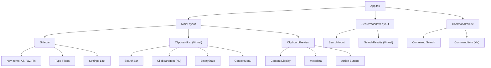

# ORNAS — UI Wireframes

> Canonical reference: [ARCHITECTURE_FINAL.md](../ARCHITECTURE_FINAL.md)

---

## Overview

All wireframes use ASCII text representation. These are functional layouts,
not pixel-perfect designs. The implementation uses React components with
TailwindCSS, supporting both dark and light modes.

**Design Principles:**
- Keyboard-first: every action reachable without a mouse
- Three-panel layout: Sidebar → List → Preview
- Minimal chrome: content takes priority
- Information density: show enough to be useful, not overwhelming

---

## 1. Main Window (3-Panel Layout)

The primary application window. Default size: `1200×700px`. Minimum: `900×500px`.

```
┌──────────────────────────────────────────────────────────────────────────┐
│  ☰ ORNAS                                          ─  □  ✕              │
├──────────┬───────────────────────────────┬───────────────────────────────┤
│          │ 🔍 Search clips...     Ctrl+K │                              │
│  ALL     │                               │  Quick Preview               │
│  ───     ├───────────────────────────────┤  ─────────────               │
│          │                               │                              │
│  📋 All  │  📌 Deploy prod script  12:04 │  Deploy prod script          │
│  ★ Fav   │     ★ 📌  Shell  ·  142 ch   │                              │
│  📌 Pin  │  ─ ─ ─ ─ ─ ─ ─ ─ ─ ─ ─ ─ ─ ─│  ┌─────────────────────────┐│
│          │  ▸ https://github.com   11:58 │  │ #!/bin/bash              ││
│  ─────── │     URL  ·  45 chars          │  │ set -euo pipefail        ││
│  TYPES   │  ─ ─ ─ ─ ─ ─ ─ ─ ─ ─ ─ ─ ─ ─│  │                         ││
│          │    { "name": "ornas" }   11:52 │  │ echo "Deploying..."     ││
│  Aa Text │     JSON  ·  89 chars         │  │ docker compose up -d    ││
│  </> Code│  ─ ─ ─ ─ ─ ─ ─ ─ ─ ─ ─ ─ ─ ─│  │ echo "Done."            ││
│  🔗 URLs │    SELECT * FROM clips  11:45 │  │                         ││
│  🖼 Image│     SQL  ·  234 chars         │  └─────────────────────────┘│
│          │  ─ ─ ─ ─ ─ ─ ─ ─ ─ ─ ─ ─ ─ ─│                              │
│  ─────── │    npm install react    11:30 │  Category:  Shell            │
│  ⚙ Set.  │     Shell  ·  18 chars       │  Copied:    12:04 (2m ago)   │
│          │  ─ ─ ─ ─ ─ ─ ─ ─ ─ ─ ─ ─ ─ ─│  Source:    Terminal         │
│          │    (more items...)             │  Characters: 142             │
│          │                               │  Lines:     6                │
│          │                               │                              │
│          │                               │  ┌──────┐ ┌────────┐        │
│          │                               │  │ Copy │ │ Delete │        │
│          │                               │  └──────┘ └────────┘        │
│          │                               │  ┌──────────┐ ┌─────┐       │
│          │                               │  │ Favorite │ │ Pin │       │
│          │                               │  └──────────┘ └─────┘       │
├──────────┴───────────────────────────────┴───────────────────────────────┤
│  13,842 items  ·  Last copied 2m ago  ·  DB: 38 MB        Ctrl+Shift+P │
└──────────────────────────────────────────────────────────────────────────┘
```

### Panel Dimensions

| Panel | Default Width | Min Width | Resizable |
|-------|-------------|-----------|-----------|
| Sidebar | 180px | 140px | No |
| Clipboard List | flex: 1 | 300px | Yes (drag border) |
| Preview Panel | 350px | 280px | Yes (drag border) |

### Keyboard Navigation Flow

```
┌──────────┐  Tab   ┌──────────┐  Tab   ┌──────────┐
│ Sidebar  │ ────→  │   List   │ ────→  │ Preview  │
│          │ ←────  │          │ ←────  │          │
└──────────┘ S+Tab  └──────────┘ S+Tab  └──────────┘
                    │ ↑↓ navigate       │
                    │ Enter → copy      │ Space toggle
                    │ Del → delete      │
```

---

## 2. Global Search Popup (Raycast-Style)

Triggered by `Ctrl+Shift+V` (system-wide). Centered, floating, no title bar.
Auto-closes after selection. Size: `640×420px`.

```
┌─────────────────────────────────────────────────────────┐
│                                                         │
│   ┌─────────────────────────────────────────────────┐   │
│   │  🔍 Search clipboard history...           Esc   │   │
│   └─────────────────────────────────────────────────┘   │
│                                                         │
│   ┌─────────────────────────────────────────────────┐   │
│   │                                                 │   │
│   │  ▸ Deploy prod script              ★ 📌  [1]   │   │
│   │    Shell  ·  142 chars  ·  2m ago              │   │
│   │  ─ ─ ─ ─ ─ ─ ─ ─ ─ ─ ─ ─ ─ ─ ─ ─ ─ ─ ─ ─ ─ │   │
│   │    https://github.com/ornas              [2]   │   │
│   │    URL  ·  45 chars  ·  8m ago                 │   │
│   │  ─ ─ ─ ─ ─ ─ ─ ─ ─ ─ ─ ─ ─ ─ ─ ─ ─ ─ ─ ─ ─ │   │
│   │    { "name": "ornas", "ver...             [3]   │   │
│   │    JSON  ·  89 chars  ·  14m ago               │   │
│   │  ─ ─ ─ ─ ─ ─ ─ ─ ─ ─ ─ ─ ─ ─ ─ ─ ─ ─ ─ ─ ─ │   │
│   │    SELECT * FROM clips WHERE...           [4]   │   │
│   │    SQL  ·  234 chars  ·  21m ago               │   │
│   │  ─ ─ ─ ─ ─ ─ ─ ─ ─ ─ ─ ─ ─ ─ ─ ─ ─ ─ ─ ─ ─ │   │
│   │    npm install react                      [5]   │   │
│   │    Shell  ·  18 chars  ·  36m ago              │   │
│   │                                                 │   │
│   └─────────────────────────────────────────────────┘   │
│                                                         │
│   ↑↓ Navigate   Enter Copy & Close   1-9 Quick Copy    │
│                                                         │
└─────────────────────────────────────────────────────────┘
```

### Search Behavior

| State | Behavior |
|-------|----------|
| Empty query | Show most recent items (sorted by `created_at DESC`) |
| Typing | Debounce 150ms → FTS5 `MATCH` query → re-rank top 50 |
| Arrow keys | Move highlight through results; wraps at edges |
| Enter | Copy highlighted item to system clipboard → close window |
| `1`–`9` | Quick-copy item at that position → close window |
| Escape | Close window without action |

---

## 3. Command Palette (Ctrl+Shift+P)

VS Code–style command palette. Modal overlay, centered. Size: `480×360px`.

```
┌──────────────────────────────────────────────┐
│  > Search commands...                   Esc  │
├──────────────────────────────────────────────┤
│                                              │
│  ▸ Clear All History             Ctrl+Shift+X│
│    Toggle Dark Mode              Ctrl+Shift+D│
│    Show Favorites Only                       │
│    Show Pinned Only                          │
│    Filter by Category...                     │
│    Export Clipboard History...                │
│    Open Settings                     Ctrl+,  │
│    Show Keyboard Shortcuts           Ctrl+/  │
│    About ORNAS                               │
│                                              │
├──────────────────────────────────────────────┤
│  ↑↓ Navigate    Enter Execute    Esc Close   │
└──────────────────────────────────────────────┘
```

### Command Palette Commands (V1.0)

| Command | Shortcut | Action |
|---------|----------|--------|
| Clear All History | `Ctrl+Shift+X` | Delete all non-favorite, non-pinned items |
| Toggle Dark Mode | `Ctrl+Shift+D` | Switch theme |
| Show Favorites Only | — | Filter list to favorites |
| Show Pinned Only | — | Filter list to pinned |
| Filter by Category | — | Sub-menu: Text, Code, URLs, Images |
| Open Settings | `Ctrl+,` | Navigate to settings panel |
| Show Keyboard Shortcuts | `Ctrl+/` | Display shortcut reference |
| About ORNAS | — | Show version and credits |

---

## 4. Settings Panel

Replaces the main content area (list + preview) when activated.
Sidebar remains visible.

```
┌──────────┬───────────────────────────────────────────────────────────────┐
│          │                                                              │
│  📋 All  │  ⚙ Settings                                         Esc ✕  │
│  ★ Fav   │  ─────────────────────────────────────────────────────────── │
│  📌 Pin  │                                                              │
│          │  GENERAL                                                      │
│  ─────── │  ┌────────────────────────────────────────────────────────┐  │
│  TYPES   │  │ Theme                          [Dark ▾]               │  │
│          │  │ ─ ─ ─ ─ ─ ─ ─ ─ ─ ─ ─ ─ ─ ─ ─ ─ ─ ─ ─ ─ ─ ─ ─ ─  │  │
│  Aa Text │  │ History retention              [90 days ▾]            │  │
│  </> Code│  │ ─ ─ ─ ─ ─ ─ ─ ─ ─ ─ ─ ─ ─ ─ ─ ─ ─ ─ ─ ─ ─ ─ ─ ─  │  │
│  🔗 URLs │  │ Max history size               [10,000 items]         │  │
│  🖼 Image│  │ ─ ─ ─ ─ ─ ─ ─ ─ ─ ─ ─ ─ ─ ─ ─ ─ ─ ─ ─ ─ ─ ─ ─ ─  │  │
│          │  │ Clear history on exit           [ ] Off                │  │
│  ─────── │  └────────────────────────────────────────────────────────┘  │
│  ⚙ Set.  │                                                              │
│  >>>     │  SHORTCUTS                                                    │
│          │  ┌────────────────────────────────────────────────────────┐  │
│          │  │ Global search hotkey           [Ctrl+Shift+V]  Edit   │  │
│          │  └────────────────────────────────────────────────────────┘  │
│          │                                                              │
│          │  PRIVACY                                                      │
│          │  ┌────────────────────────────────────────────────────────┐  │
│          │  │ Excluded apps                  [+] Add app            │  │
│          │  │   1Password                              [✕]          │  │
│          │  │   Bitwarden                              [✕]          │  │
│          │  │ ─ ─ ─ ─ ─ ─ ─ ─ ─ ─ ─ ─ ─ ─ ─ ─ ─ ─ ─ ─ ─ ─ ─ ─  │  │
│          │  │ Max image size                 [10 MB ▾]              │  │
│          │  └────────────────────────────────────────────────────────┘  │
│          │                                                              │
│          │  ADVANCED                                                     │
│          │  ┌────────────────────────────────────────────────────────┐  │
│          │  │ Database size                  38 MB                   │  │
│          │  │ Run VACUUM                     [Optimize]              │  │
│          │  └────────────────────────────────────────────────────────┘  │
│          │                                                              │
└──────────┴───────────────────────────────────────────────────────────────┘
```

### Settings Sections

| Section | Settings | Storage |
|---------|----------|---------|
| General | Theme, retention, max size, clear on exit | `settings` table |
| Shortcuts | Global search hotkey | `settings` table |
| Privacy | Excluded apps, max image size | `settings` table |
| Advanced | DB size display, manual VACUUM | Read-only + action |

---

## 5. Empty State (First Run)

Shown when the clipboard history is empty (first launch or after clearing).

```
┌──────────┬───────────────────────────────────────────────────────────────┐
│          │                                                              │
│  📋 All  │                                                              │
│  ★ Fav   │                                                              │
│  📌 Pin  │                                                              │
│          │                                                              │
│  ─────── │                                                              │
│  TYPES   │               ┌─────────────────────────┐                    │
│          │               │                         │                    │
│  Aa Text │               │      📋                 │                    │
│  </> Code│               │                         │                    │
│  🔗 URLs │               │  Your clipboard is      │                    │
│  🖼 Image│               │  empty — for now.       │                    │
│          │               │                         │                    │
│  ─────── │               │  Copy anything and it   │                    │
│  ⚙ Set.  │               │  will appear here.      │                    │
│          │               │                         │                    │
│          │               │  ─ ─ ─ ─ ─ ─ ─ ─ ─ ─   │                    │
│          │               │                         │                    │
│          │               │  Quick tips:             │                    │
│          │               │  Ctrl+Shift+V  Search   │                    │
│          │               │  Ctrl+Shift+P  Commands │                    │
│          │               │  Ctrl+K        Filter   │                    │
│          │               │                         │                    │
│          │               └─────────────────────────┘                    │
│          │                                                              │
│          │                                                              │
└──────────┴───────────────────────────────────────────────────────────────┘
```

### Empty State Behavior

| Trigger | Display |
|---------|---------|
| Zero clips in DB | Full empty state with tips |
| Zero results from search | "No results for '{query}'" with suggestion to broaden |
| Zero items in category filter | "No {category} items yet" |

---

## 6. Right-Click Context Menu

Appears on right-click of any clipboard item in the list.
Positioned at cursor. Dismisses on click-outside or Escape.

```
                    ┌──────────────────────────────┐
                    │  📋 Copy                Enter │
                    │  ─ ─ ─ ─ ─ ─ ─ ─ ─ ─ ─ ─ ─ │
                    │  ★  Favorite            Ctrl+F│
                    │  📌 Pin to Top                │
                    │  ─ ─ ─ ─ ─ ─ ─ ─ ─ ─ ─ ─ ─ │
                    │  📄 Copy as Plain Text        │
                    │  ─ ─ ─ ─ ─ ─ ─ ─ ─ ─ ─ ─ ─ │
                    │  🗑  Delete              Del  │
                    └──────────────────────────────┘
```

### Context Menu Items

| Item | Action | Keyboard Shortcut |
|------|--------|-------------------|
| Copy | Copy content to system clipboard | `Enter` |
| Favorite | Toggle favorite status | `Ctrl+F` |
| Pin to Top | Toggle pinned status | — |
| Copy as Plain Text | Strip formatting, copy text only | — |
| Delete | Remove item permanently | `Delete` |

---

## UI Component Hierarchy



---

## Responsive Behavior

| Viewport Width | Layout Adaptation |
|---------------|-------------------|
| ≥ 1200px | Full 3-panel layout |
| 900–1199px | Preview panel hidden by default (Space to toggle) |
| < 900px | Not supported (desktop app minimum) |

---

## Theme Tokens

| Token | Dark Mode | Light Mode |
|-------|-----------|------------|
| `--bg-primary` | `#0f0f13` | `#ffffff` |
| `--bg-secondary` | `#1a1a24` | `#f5f5f7` |
| `--bg-tertiary` | `#252533` | `#e8e8ed` |
| `--text-primary` | `#e4e4ed` | `#1a1a2e` |
| `--text-secondary` | `#8b8ba3` | `#6b6b80` |
| `--accent` | `#6366f1` | `#4f46e5` |
| `--border` | `#2a2a3d` | `#d4d4de` |
| `--highlight` | `#6366f1/15%` | `#4f46e5/10%` |

---

> All wireframes are functional specifications, not visual designs.
> Final implementation uses TailwindCSS utility classes with the design
> tokens defined above.
