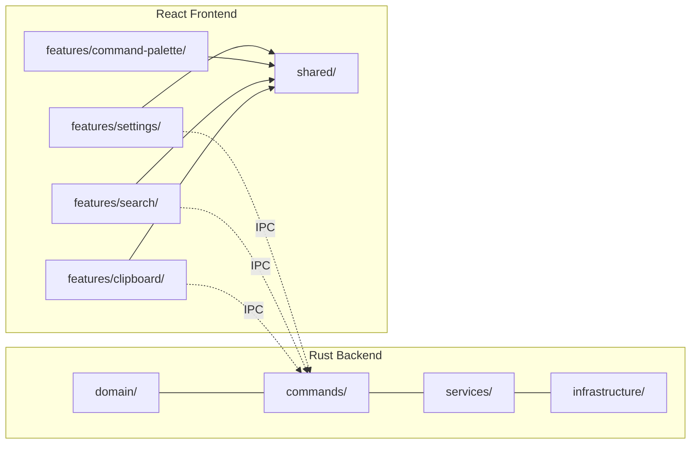

# ORNAS — Feature Matrix

> Canonical reference: [ARCHITECTURE_FINAL.md](../ARCHITECTURE_FINAL.md)

---

## Overview

This document maps every feature across all planned versions to its priority,
complexity, implementation status, Rust backend module, and React frontend module.
It is the single cross-reference for tracking what exists, what's in progress,
and what's planned.

**Legend:**

| Column | Values |
|--------|--------|
| **Priority** | `P0` = Must-have for release · `P1` = Should-have · `P2` = Nice-to-have |
| **Complexity** | `S` = Small (1–3 days) · `M` = Medium (4–7 days) · `L` = Large (8+ days) |
| **Status** | `planned` · `in-progress` · `complete` · `shipped` |

---

## V1.0 — Core Clipboard Manager (18 Features)

| # | Feature | Priority | Complexity | Status | Rust Module | React Feature |
|---|---------|----------|-----------|--------|-------------|---------------|
| 1 | Clipboard monitoring + history | P0 | L | complete | `infrastructure/clipboard/monitor.rs`, `native.rs`, `wayland.rs` | `features/clipboard/` |
| 2 | FTS5 instant search | P0 | M | complete | `infrastructure/database/search_repo.rs` | `features/search/` |
| 3 | Smart categorization (16+ types) | P0 | M | complete | `domain/category.rs`, `infrastructure/pipeline/categorizer.rs` | — (auto, backend only) |
| 4 | Duplicate detection | P0 | S | complete | `infrastructure/pipeline/dedup.rs`, `infrastructure/pipeline/hasher.rs` | — (auto, backend only) |
| 5 | Favorites (star/unstar) | P1 | S | complete | `commands/clipboard.rs` (favorite cmd) | `ClipboardItem.tsx`, `useClipboardActions.ts` |
| 6 | Pinned items (stay at top) | P1 | S | complete | `commands/clipboard.rs` (pin cmd) | `ClipboardItem.tsx`, `useClipboardActions.ts` |
| 7 | Quick preview panel | P0 | M | complete | — (data from existing queries) | `ClipboardPreview.tsx` |
| 8 | Image clipboard support | P0 | M | complete | `infrastructure/image_store.rs`, `infrastructure/clipboard/` | `ClipboardPreview.tsx` (image display) |
| 9 | Global search window (Raycast-style) | P0 | L | complete | — (uses existing search backend) | `shared/layouts/SearchWindowLayout.tsx` |
| 10 | Command palette | P1 | M | complete | — (frontend only) | `features/command-palette/` |
| 11 | Keyboard shortcuts (full navigation) | P0 | M | complete | — (frontend only) | `shared/hooks/useHotkey.ts` |
| 12 | Dark mode + light mode | P1 | S | complete | — (frontend only) | `shared/hooks/useTheme.ts`, `styles/globals.css` |
| 13 | Settings (retention, theme, hotkey) | P1 | M | complete | `commands/settings.rs`, `services/settings_service.rs` | `features/settings/` |
| 14 | Collections UI (CRUD) | P1 | M | complete | `commands/collections.rs`, `services/collection_service.rs`, `database/collection_repo.rs` | `features/collections/` |
| 15 | Tags UI (CRUD) | P1 | M | complete | `commands/tags.rs`, `services/tag_service.rs`, `database/tag_repo.rs` | `features/tags/` |
| 16 | Vault (XChaCha20-Poly1305 encryption)| P0 | L | complete | `domain/vault.rs`, `infrastructure/crypto/` | `features/vault/` |
| 17 | Syntax highlighting | P2 | M | complete | — (frontend only) | `shiki` or `prism` integration in `ClipboardPreview.tsx` |
| 18 | Bulk Actions | P1 | S | complete | `commands/clipboard.rs` (bulk cmds) | `ClipboardList.tsx`, `useClipboardActions.ts` |

### V1.0 Summary

| Metric | Count |
|--------|-------|
| Total features | 18 |
| P0 (must-have) | 10 |
| P1 (should-have) | 7 |
| P2 (nice-to-have) | 1 |
| Small (S) | 5 |
| Medium (M) | 10 |
| Large (L) | 3 |

---

## V1.0 Pipeline Stages

The clipboard pipeline is an internal subsystem, not a user-facing feature.
Listed separately for implementation tracking.

| Stage | Name | Purpose | Rust Module | Complexity |
|-------|------|---------|-------------|-----------|
| 1 | Normalizer | Trim, normalize line endings, NFC, strip nulls | `pipeline/normalizer.rs` | S |
| 2 | Hasher | xxHash64 of normalized content | `pipeline/hasher.rs` | S |
| 3 | Dedup | LRU-500 check → DB fallback → skip or continue | `pipeline/dedup.rs` | S |
| 4 | Categorizer | Regex-based detection (16+ content types) | `pipeline/categorizer.rs` | M |
| 5 | Metadata | Preview, char/line count, source app | `pipeline/metadata.rs` | S |
| 6 | Persister | Image save + SQLite INSERT + FTS5 trigger | `pipeline/persister.rs` | M |
| 7 | Notifier | Emit `clip-created` Tauri event | `pipeline/notifier.rs` | S |

---

## V1.1 — Organization (4 Features)

| # | Feature | Priority | Complexity | Status | Rust Module | React Feature |
|---|---------|----------|-----------|--------|-------------|---------------|
| 19 | Timeline view | P2 | M | planned | — (uses existing clip queries with date grouping) | `features/timeline/` |
| 20 | Tag Colors | P1 | S | planned | `commands/tags.rs` (update color) | `features/tags/` |
| 21 | File clipboard support | P1 | L | planned | `infrastructure/clipboard/` (file list detection) | `ClipboardItem.tsx` (file icon/path) |
| 22 | Import / export (JSON) | P1 | M | planned | `commands/export.rs`, `services/export_service.rs` | `features/settings/` (export button) |

---

## V1.2 — Productivity (3 Features)

| # | Feature | Priority | Complexity | Status | Rust Module | React Feature |
|---|---------|----------|-----------|--------|-------------|---------------|
| 23 | Snippet manager | P1 | L | planned | `domain/snippet.rs`, `commands/snippets.rs`, `database/snippet_repo.rs` | `features/snippets/` |
| 24 | Backup / restore | P1 | M | planned | `services/backup_service.rs` (SQLite backup API) | `features/settings/` (backup button) |
| 25 | File System Integration | P1 | L | planned | `infrastructure/clipboard/` (bidirectional files) | `features/clipboard/` |

---

## Cross-Version Summary

| Version | Features | P0 | P1 | P2 | S | M | L |
|---------|----------|----|----|----|----|---|---|
| **V1.0** | 18 | 10 | 7 | 1 | 5 | 10 | 3 |
| **V1.1** | 4 | 0 | 3 | 1 | 1 | 2 | 1 |
| **V1.2** | 3 | 0 | 3 | 0 | 0 | 1 | 2 |
| **Total** | **25** | **10** | **13** | **2** | **6** | **13** | **6** |

---

## Module Ownership Map

```mermaid
graph LR
    subgraph "Rust Backend"
        D["domain/"]
        C["commands/"]
        S["services/"]
        I["infrastructure/"]
    end

    subgraph "React Frontend"
        FC["features/clipboard/"]
        FS["features/search/"]
        FCP["features/command-palette/"]
        FST["features/settings/"]
        SH["shared/"]
    end

    D --- C
    C --- S
    S --- I

    FC -.->|IPC| C
    FS -.->|IPC| C
    FST -.->|IPC| C

    FC --> SH
    FS --> SH
    FCP --> SH
    FST --> SH
```

---

## Feature → Tauri Event Mapping

| Feature | Events Produced | Events Consumed |
|---------|----------------|-----------------|
| Clipboard monitoring | `clip-created` | — |
| Favorites | `clip-updated` | — |
| Pinned items | `clip-updated` | — |
| Delete | `clip-deleted` | — |
| Settings | `settings-changed` | — |
| Clipboard list (FE) | — | `clip-created`, `clip-deleted`, `clip-updated` |
| Settings panel (FE) | — | `settings-changed` |

---

## Feature → Database Table Mapping

| Feature | Tables Read | Tables Written |
|---------|------------|---------------|
| Clipboard monitoring | — | `clips`, `clips_fts` |
| FTS5 search | `clips`, `clips_fts` | — |
| Categorization | — | `clips.category` |
| Duplicate detection | `clips.content_hash` | `clips.updated_at` |
| Favorites | `clips.is_favorite` | `clips.is_favorite` |
| Pinned items | `clips.is_pinned` | `clips.is_pinned` |
| Settings | `settings` | `settings` |
| Collections | `collections`, `clip_collections` | `collections`, `clip_collections` |
| Tags | `tags`, `clip_tags` | `tags`, `clip_tags` |

---

> **Tracking Rule:** When a feature's status changes, update this document.
> This matrix is the source of truth for implementation progress across all versions.
