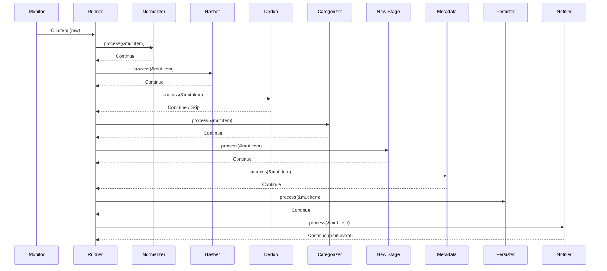

# ORNAS — Development Guide

> Canonical reference: [ARCHITECTURE_FINAL.md](../ARCHITECTURE_FINAL.md)

---

## Overview

This guide gets a new contributor from zero to running ORNAS locally in
under 30 minutes. It also provides step-by-step recipes for the most common
development tasks.

**Goal:** A new contributor should understand the codebase in one afternoon
(Principle #10: Open-source friendly).

---

## Prerequisites

### Required Toolchain

| Tool | Minimum | Recommended | Install |
|------|---------|-------------|---------|
| **Rust** | 1.85.0 (2024 edition) | Latest stable | [rustup.rs](https://rustup.rs) |
| **Node.js** | 20 LTS | 22 LTS | [nodejs.org](https://nodejs.org) |
| **npm** | 10+ | Latest | Comes with Node.js |
| **Tauri CLI** | 2.0 | Latest 2.x | `cargo install tauri-cli` |

### Platform-Specific Dependencies

#### Linux (Debian/Ubuntu)

```bash
sudo apt update
sudo apt install -y \
  build-essential \
  libwebkit2gtk-4.1-dev \
  libgtk-3-dev \
  libayatana-appindicator3-dev \
  librsvg2-dev \
  libxdo-dev \
  curl \
  wget
```

#### Linux (Fedora)

```bash
sudo dnf install -y \
  webkit2gtk4.1-devel \
  gtk3-devel \
  libappindicator-gtk3-devel \
  librsvg2-devel \
  libxdo-devel
```

#### macOS

```bash
xcode-select --install
```

#### Windows

1. Install [Visual Studio Build Tools 2019+](https://visualstudio.microsoft.com/visual-cpp-build-tools/)
2. Install [WebView2 Runtime](https://developer.microsoft.com/en-us/microsoft-edge/webview2/) (pre-installed on Windows 11)

---

## Setup Steps

### 1. Clone the Repository

```bash
git clone https://github.com/sanromarth/ornas.git
cd ornas
```

### 2. Install Frontend Dependencies

```bash
npm install
```

### 3. Verify Rust Toolchain

```bash
rustc --version          # Should be ≥ 1.85.0
cargo --version
cargo tauri --version    # Should be ≥ 2.0
```

### 4. Run in Development Mode

```bash
cargo tauri dev
```

This command:
1. Starts the Vite dev server (frontend hot-reload)
2. Compiles the Rust backend
3. Opens the application window
4. Watches for file changes (Rust recompiles, frontend hot-reloads)

**First build takes ~2–5 minutes** (downloading + compiling Rust dependencies).
Subsequent builds take ~5–15 seconds.

### 5. Verify Everything Works

| Check | Expected Result |
|-------|----------------|
| Window opens | 3-panel layout visible |
| Copy any text | Item appears in clipboard list |
| `Ctrl+Shift+V` | Global search popup opens |
| `Ctrl+Shift+P` | Command palette opens |
| `Ctrl+,` | Settings panel opens |

---

## Development Commands

| Command | Purpose | When to Use |
|---------|---------|-------------|
| `cargo tauri dev` | Run app in dev mode (hot-reload) | Daily development |
| `cargo tauri build` | Production build (release binary) | Before release |
| `cargo test` | Run all Rust tests | Before committing |
| `cargo clippy` | Run Rust linter | Before committing |
| `cargo fmt --check` | Check Rust formatting | CI / pre-commit |
| `npm run dev` | Run frontend only (no Tauri) | UI-only work |
| `npm run build` | Build frontend for production | Bundled by `tauri build` |
| `npm run lint` | Run ESLint | Before committing |
| `npm run type-check` | Run TypeScript type checker | Before committing |
| `cargo audit` | Check Rust deps for vulnerabilities | Weekly / CI |
| `npm audit` | Check JS deps for vulnerabilities | Weekly / CI |

### Useful Development Shortcuts

```bash
# Run only domain unit tests (fast)
cargo test --lib domain

# Run a specific test by name
cargo test test_categorize_url

# Run with verbose logging
RUST_LOG=debug cargo tauri dev

# Check Rust compilation without running
cargo check

# Build release binary with optimizations
cargo tauri build --release
```

---

## Project Structure Quick Reference

```
ORNAS/
├── src-tauri/src/              # Rust backend
│   ├── commands/               #   IPC handlers (thin)
│   ├── services/               #   Business logic
│   ├── domain/                 #   Pure types + traits (NO I/O)
│   ├── infrastructure/         #   I/O implementations
│   │   ├── database/           #     SQLite repos
│   │   ├── clipboard/          #     OS clipboard monitor
│   │   └── pipeline/           #     7-stage processor
│   ├── error.rs                #   Error types
│   ├── state.rs                #   AppState
│   └── lib.rs                  #   App builder
├── src/                        # React frontend
│   ├── features/               #   Feature modules (isolated)
│   ├── shared/                 #   Reusable components + hooks
│   ├── services/               #   Tauri IPC abstraction
│   └── stores/                 #   Zustand state
└── docs/architecture/          # You are here
```

### Architecture Layer Rules

| Rule | Violation Check |
|------|----------------|
| `domain/` has zero external crate imports | `grep -r "use rusqlite\|use clipboard_rs" src-tauri/src/domain/` should return nothing |
| `commands/` never imports `infrastructure/` | `grep -r "use crate::infrastructure" src-tauri/src/commands/` should return nothing |
| Feature modules never import other features | `grep -r "features/" src/features/clipboard/` should only show self-references |
| `shared/` never imports from `features/` | `grep -r "features/" src/shared/` should return nothing |
| Every Rust file < 300 lines | `find src-tauri -name "*.rs" -exec wc -l {} +` |
| Every React component < 150 lines | `find src -name "*.tsx" -exec wc -l {} +` |

---

## How to Add a Tauri Command (5 Steps)

This is the most common backend task. A Tauri command exposes a Rust function
to the React frontend via IPC.

### Step 1: Define the Domain Type (if needed)

```rust
// src-tauri/src/domain/clip.rs
// Add or modify a struct that the command will return

#[derive(Debug, Clone, Serialize, Deserialize)]
pub struct ClipStats {
    pub total_count: u64,
    pub favorite_count: u64,
    pub category_breakdown: Vec<(String, u64)>,
}
```

> **Rule:** Domain types have no I/O dependencies. Only `serde` and `std`.

### Step 2: Add a Repository Method (if needed)

```rust
// src-tauri/src/domain/traits.rs
// Add the method to the trait definition

pub trait ClipRepository: Send + Sync {
    // ... existing methods ...
    fn get_stats(&self) -> Result<ClipStats, AppError>;
}
```

```rust
// src-tauri/src/infrastructure/database/clip_repo.rs
// Implement the method using SQLite

impl ClipRepository for SqliteClipRepo {
    fn get_stats(&self) -> Result<ClipStats, AppError> {
        let conn = self.pool.get()?;
        let total: u64 = conn.query_row(
            "SELECT COUNT(*) FROM clips",
            [], |row| row.get(0)
        )?;
        // ... build and return ClipStats
        Ok(ClipStats { total_count: total, ..Default::default() })
    }
}
```

### Step 3: Add a Service Method

```rust
// src-tauri/src/services/clipboard_service.rs

impl ClipboardService {
    pub fn get_stats(&self) -> Result<ClipStats, AppError> {
        self.clip_repo.get_stats()
    }
}
```

> **Rule:** Services orchestrate, they don't do I/O directly.

### Step 4: Create the Tauri Command

```rust
// src-tauri/src/commands/clipboard.rs

#[tauri::command]
pub async fn get_clip_stats(
    state: State<'_, AppState>,
) -> Result<ClipStats, String> {
    state.clipboard_service
        .get_stats()
        .map_err(|e| e.to_string())
}
```

> **Rule:** Commands are thin — validate, delegate, return.

### Step 5: Register the Command

```rust
// src-tauri/src/lib.rs

tauri::Builder::default()
    .invoke_handler(tauri::generate_handler![
        // ... existing commands ...
        commands::clipboard::get_clip_stats,  // ← Add here
    ])
```

### Verification Checklist

- [ ] Domain type defined with `Serialize`/`Deserialize`
- [ ] Trait method added in `domain/traits.rs`
- [ ] Implementation in `infrastructure/database/`
- [ ] Service method in `services/`
- [ ] Command in `commands/` with `#[tauri::command]`
- [ ] Registered in `lib.rs` `invoke_handler`
- [ ] Unit test for domain logic
- [ ] Integration test for repository

---

## How to Add a React Feature Module (4 Steps)

Feature modules are isolated, self-contained UI features. They follow a
consistent structure.

### Step 1: Create the Feature Directory

```
src/features/my-feature/
├── components/
│   ├── MyFeatureView.tsx       # Main component
│   └── MyFeatureItem.tsx       # Child component
├── hooks/
│   └── useMyFeature.ts         # Custom hooks
├── api/
│   ├── queries.ts              # TanStack Query read operations
│   ├── mutations.ts            # TanStack Query write operations
│   └── keys.ts                 # Query key factory
├── store.ts                    # Zustand slice (if needed)
└── index.ts                    # Public barrel export
```

### Step 2: Define the API Layer

```typescript
// src/features/my-feature/api/keys.ts
export const myFeatureKeys = {
  all: ['my-feature'] as const,
  list: () => [...myFeatureKeys.all, 'list'] as const,
  detail: (id: number) => [...myFeatureKeys.all, 'detail', id] as const,
};
```

```typescript
// src/features/my-feature/api/queries.ts
import { useQuery } from '@tanstack/react-query';
import { invoke } from '../../services/invoke';
import { myFeatureKeys } from './keys';

export function useMyFeatureList() {
  return useQuery({
    queryKey: myFeatureKeys.list(),
    queryFn: () => invoke<MyFeatureItem[]>('list_my_feature'),
  });
}
```

### Step 3: Build the Component

```typescript
// src/features/my-feature/components/MyFeatureView.tsx
import { useMyFeatureList } from '../api/queries';

export function MyFeatureView() {
  const { data, isLoading, error } = useMyFeatureList();

  if (isLoading) return <div>Loading...</div>;
  if (error) return <div>Error: {error.message}</div>;

  return (
    <div className="...">
      {data?.map(item => (
        <MyFeatureItem key={item.id} item={item} />
      ))}
    </div>
  );
}
```

> **Rule:** Components < 150 lines. Extract logic into hooks.

### Step 4: Export via Barrel File

```typescript
// src/features/my-feature/index.ts
export { MyFeatureView } from './components/MyFeatureView';
export { useMyFeatureList } from './api/queries';
```

> **Rule:** Other features import ONLY from `index.ts`, never internal paths.

### Feature Module Checklist

- [ ] Directory structure follows convention
- [ ] Query keys defined in `api/keys.ts`
- [ ] TanStack Query hooks in `api/queries.ts`
- [ ] Components use `shared/` primitives (Button, Input, etc.)
- [ ] Barrel export in `index.ts`
- [ ] No imports from other feature modules' internals
- [ ] Tauri event listener for real-time updates (via `useTauriEvent`)

---

## How to Add a Pipeline Stage (3 Steps)

Pipeline stages process clipboard content sequentially. Each stage
implements the `PipelineStage` trait.

### Step 1: Implement the Stage

```rust
// src-tauri/src/infrastructure/pipeline/my_stage.rs

use crate::domain::pipeline::{PipelineStage, StageAction, PipelineError};
use crate::domain::clip::ClipItem;

pub struct MyStage;

impl PipelineStage for MyStage {
    fn name(&self) -> &'static str {
        "my_stage"
    }

    async fn process(&self, item: &mut ClipItem) -> Result<StageAction, PipelineError> {
        // Transform or inspect the item
        // Return Continue to pass to next stage
        // Return Skip { reason } to stop the pipeline
        Ok(StageAction::Continue)
    }
}
```

> **Rule:** Each stage < 100 lines. Single responsibility.

### Step 2: Register in the Pipeline Runner

```rust
// src-tauri/src/infrastructure/pipeline/runner.rs

impl PipelineRunner {
    pub fn new(/* dependencies */) -> Self {
        Self {
            stages: vec![
                Box::new(Normalizer),
                Box::new(Hasher),
                Box::new(Dedup::new(/* ... */)),
                Box::new(Categorizer),
                Box::new(MyStage),          // ← Insert at correct position
                Box::new(Metadata),
                Box::new(Persister::new(/* ... */)),
                Box::new(Notifier::new(/* ... */)),
            ],
        }
    }
}
```

### Step 3: Add the Module Export

```rust
// src-tauri/src/infrastructure/pipeline/mod.rs

pub mod runner;
pub mod normalizer;
pub mod hasher;
pub mod dedup;
pub mod categorizer;
pub mod my_stage;     // ← Add here
pub mod metadata;
pub mod persister;
pub mod notifier;
```

### Pipeline Stage Rules

| Rule | Details |
|------|---------|
| **Pure logic only** | Stages in `domain/` test without I/O mocks |
| **I/O in infra only** | Stages needing DB or filesystem live in `infrastructure/pipeline/` |
| **Return `Skip` to halt** | Don't panic or silently swallow errors |
| **Order matters** | Normalizer → Hasher → Dedup → Categorizer → ... → Notifier |
| **< 100 lines** | If a stage is growing, it's doing too much |

### Pipeline Stage Data Flow



---

## Debugging Tips

| Scenario | Tool | Command |
|----------|------|---------|
| Rust backend logs | `tracing` | `RUST_LOG=debug cargo tauri dev` |
| Frontend state inspection | React DevTools | Install browser extension |
| TanStack Query state | Query DevTools | Included in dev builds |
| SQLite queries | DB Browser for SQLite | Open `~/.local/share/ornas/ornas.db` |
| IPC calls | Browser DevTools console | Watch for `__TAURI_IPC__` messages |
| Clipboard events | Rust logs | Look for `pipeline` span in logs |

---

## Code Style & Conventions

| Language | Formatter | Linter | Config |
|----------|-----------|--------|--------|
| Rust | `rustfmt` | `clippy` | Default settings |
| TypeScript | Prettier | ESLint | `.eslintrc.json` |
| CSS | Prettier | Stylelint (optional) | TailwindCSS config |

### Naming Conventions

| Item | Rust | TypeScript |
|------|------|-----------|
| Files | `snake_case.rs` | `PascalCase.tsx` (components), `camelCase.ts` (utils) |
| Functions | `snake_case` | `camelCase` |
| Types/Structs | `PascalCase` | `PascalCase` |
| Constants | `SCREAMING_SNAKE` | `SCREAMING_SNAKE` |
| Tauri commands | `snake_case` | Invoked as `snake_case` strings |

---

> **Remember:** Simplicity first (Principle #1).
> If you're adding something complex, ask: "Does this earn its complexity?"
