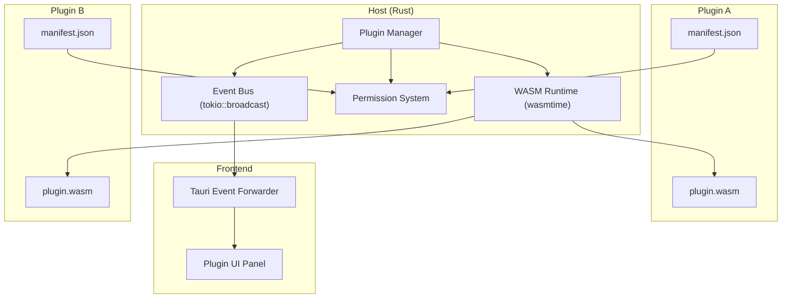
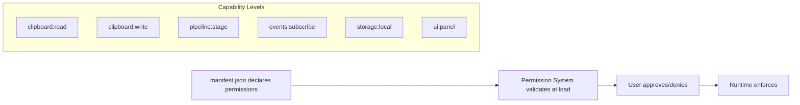
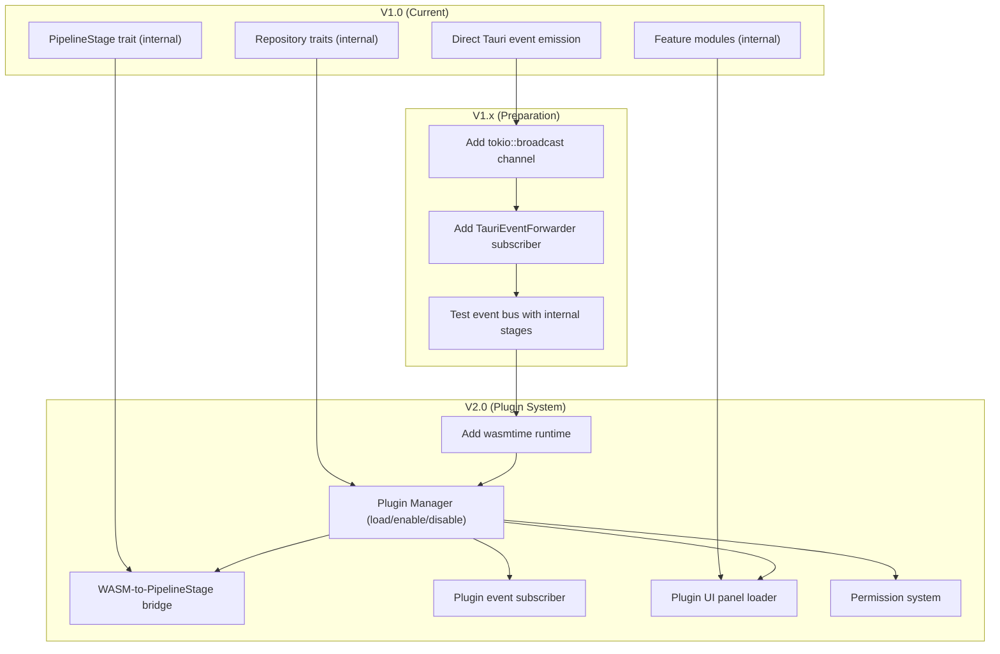

# ORNAS — Plugin Architecture

> Canonical reference: [ARCHITECTURE_FINAL.md](../ARCHITECTURE_FINAL.md)

---

## Overview

ORNAS is designed for extensibility — but not at the cost of premature
complexity. This document explains why V1.0 ships without a plugin SDK,
what extension points exist today, the V2.0 plugin vision, and the
concrete architectural path from V1 → V2.

**Core Tension:** Users want extensibility. Principle #2 says: earn complexity.
The resolution: build the foundation that makes plugins natural, but don't
ship the plugin runtime until real users demand it.

---

## Why No Plugin SDK in V1.0

### Principle #2: Earn Complexity

> *No abstraction exists without a concrete, current use case.*

| Question | Answer |
|----------|--------|
| Do we have users? | No — V1.0 is the first release. |
| Do we know what plugins would do? | Speculative — we have ideas, not requirements. |
| Can we design a stable API without usage data? | No — APIs designed in a vacuum are wrong. |
| What happens if we ship a bad plugin API? | Breaking changes, angry developers, maintenance burden. |
| What's the cost of adding plugins later? | Low — the architecture is designed for it (see §4). |

### What V1.0 Ships Instead

V1.0 ships with **internal extension points** that serve the same purpose
as a plugin system, but without the external API surface:

| Extension Point | Mechanism | How It Enables V2 Plugins |
|----------------|-----------|--------------------------|
| `PipelineStage` trait | New processing stages can be added | Plugins will implement `PipelineStage` via WASM |
| Repository traits | Storage backends are swappable | Plugins can provide alternative storage |
| Tauri event system | Loose coupling between backend and frontend | Plugin events use the same channel |
| Feature modules | Isolated UI features with barrel exports | Plugin UIs follow the same pattern |

### What Was Explicitly Removed

| Item | Reason |
|------|--------|
| WASM runtime (`wasmtime`) | ~5MB binary size increase. No users to justify it. |
| Plugin manifest schema | Designing without real plugins means getting it wrong. |
| Plugin permissions model | Can't design security for unknown capabilities. |
| Plugin marketplace/registry | Zero plugins exist. Zero demand. |
| Event bus (`tokio::broadcast`) | Only one subscriber in V1.0. Direct emission is simpler. |

---

## Current Extension Points (V1.0)

### 1. PipelineStage Trait

The primary extension mechanism. Every clipboard item passes through a
pipeline of stages, each implementing this trait:

```rust
/// Defined in domain/pipeline.rs — no I/O dependencies
pub trait PipelineStage: Send + Sync {
    fn name(&self) -> &'static str;
    async fn process(
        &self,
        item: &mut ClipItem,
    ) -> Result<StageAction, PipelineError>;
}

pub enum StageAction {
    Continue,
    Skip { reason: &'static str },
}
```

**Current stages (V1.0):**

| # | Stage | Responsibility | File |
|---|-------|---------------|------|
| 1 | Normalizer | Trim, normalize line endings, NFC | `pipeline/normalizer.rs` |
| 2 | Hasher | xxHash64 of content | `pipeline/hasher.rs` |
| 3 | Dedup | LRU + DB duplicate check | `pipeline/dedup.rs` |
| 4 | Categorizer | Regex-based content type detection | `pipeline/categorizer.rs` |
| 5 | Metadata | Preview, char/line count, source app | `pipeline/metadata.rs` |
| 6 | Persister | SQLite INSERT + image file save | `pipeline/persister.rs` |
| 7 | Notifier | Emit Tauri event | `pipeline/notifier.rs` |

**Adding a new stage (internal):** See `09_DEVELOPMENT_GUIDE.md` § "How to Add a Pipeline Stage."

### 2. Repository Traits (Swappable Backends)

All data access goes through trait interfaces defined in `domain/traits.rs`:

```rust
pub trait ClipRepository: Send + Sync {
    fn insert(&self, clip: &NewClip) -> Result<i64, AppError>;
    fn get_by_id(&self, id: i64) -> Result<Option<Clip>, AppError>;
    fn list(&self, offset: u32, limit: u32) -> Result<Vec<Clip>, AppError>;
    fn delete(&self, id: i64) -> Result<(), AppError>;
    fn update_favorite(&self, id: i64, val: bool) -> Result<(), AppError>;
    fn update_pinned(&self, id: i64, val: bool) -> Result<(), AppError>;
    fn find_by_hash(&self, hash: &str) -> Result<Option<Clip>, AppError>;
}

pub trait SearchRepository: Send + Sync {
    fn search(&self, query: &str, limit: u32) -> Result<Vec<Clip>, AppError>;
}

pub trait SettingsRepository: Send + Sync {
    fn get(&self, key: &str) -> Result<Option<String>, AppError>;
    fn set(&self, key: &str, value: &str) -> Result<(), AppError>;
    fn get_all(&self) -> Result<Vec<(String, String)>, AppError>;
}
```

**V1.0 implementations:** SQLite (via `rusqlite`).
**Future:** A plugin could provide an alternative backend (e.g., PostgreSQL,
encrypted store) by implementing these traits.

### 3. Tauri Event System

Events are the communication backbone between Rust and React:

| Event | Producer | Consumer |
|-------|----------|----------|
| `clip-created` | Notifier stage | Frontend (invalidate queries) |
| `clip-deleted` | ClipboardService | Frontend (invalidate queries) |
| `clip-updated` | ClipboardService | Frontend (invalidate queries) |
| `settings-changed` | SettingsService | Frontend (invalidate settings) |

**V2 extension:** Plugin events will use the same Tauri event channel,
namespaced as `plugin:<plugin-id>:<event-name>`.

### 4. Feature Module Pattern (Frontend)

Each React feature is isolated with a consistent structure:

```
features/<name>/
├── components/     # UI components
├── hooks/          # Custom hooks
├── api/            # TanStack Query wrappers
├── store.ts        # Zustand slice (optional)
└── index.ts        # Barrel export (public API)
```

V2 plugins will follow this pattern, with components loaded dynamically.

---

## V2.0 Plugin Vision

### Architecture Overview



### WASM Sandbox

Plugins run in a `wasmtime` WASM sandbox with strict resource limits:

| Resource | Limit | Rationale |
|----------|-------|-----------|
| Memory | 64 MB per plugin | Prevent runaway allocations |
| CPU time | 100ms per invocation | Prevent blocking the pipeline |
| Filesystem | None (by default) | Declared in manifest, capability-gated |
| Network | None (by default) | Declared in manifest, capability-gated |
| Clipboard access | Read-only (by default) | Full access requires explicit permission |

### Plugin Manifest (manifest.json)

```json
{
  "id": "com.example.my-plugin",
  "name": "My Plugin",
  "version": "1.0.0",
  "description": "Adds OCR capability to clipboard items",
  "author": "Developer Name",
  "license": "MIT",
  "engine": "wasm",
  "entry": "plugin.wasm",
  "permissions": [
    "clipboard:read",
    "pipeline:stage"
  ],
  "hooks": {
    "pipeline_stage": {
      "name": "ocr",
      "after": "categorizer",
      "before": "metadata"
    }
  },
  "ui": {
    "settings": "settings.html"
  }
}
```

### Lifecycle Hooks

| Hook | When | Purpose |
|------|------|---------|
| `on_load` | Plugin loaded by manager | Initialize state, validate config |
| `on_enable` | User enables plugin | Register pipeline stages, subscribe events |
| `on_disable` | User disables plugin | Unregister stages, unsubscribe events |
| `on_unload` | Plugin removed | Cleanup resources, remove data |
| `on_clip_process` | Pipeline runs (if registered) | Process clipboard item as a stage |
| `on_event` | Subscribed event fires | React to clipboard or system events |

### Plugin Permissions Model



| Permission | Description | Risk Level |
|-----------|-------------|-----------|
| `clipboard:read` | Read clipboard items (content, metadata) | Low |
| `clipboard:write` | Modify clipboard items | Medium |
| `pipeline:stage` | Register as a pipeline stage | Medium |
| `events:subscribe` | Subscribe to system events | Low |
| `storage:local` | Read/write plugin-specific storage (sandboxed) | Low |
| `ui:panel` | Display a UI panel in the main window | Low |
| `filesystem:read` | Read files from user's filesystem | High |
| `network:http` | Make outbound HTTP requests | High |

---

## Architectural Path: V1 → V2

The migration from V1 (no plugins) to V2 (full plugin system) is designed
to require **zero breaking changes** to existing code.

### Step-by-Step Migration



### Migration Steps (Detailed)

| Step | Change | Impact on Existing Code |
|------|--------|------------------------|
| 1 | Add `tokio::broadcast` channel to `AppState` | None — additive |
| 2 | Services emit to broadcast instead of `app_handle` directly | Services change 1 line each |
| 3 | Add `TauriEventForwarder` that bridges broadcast → Tauri events | None — frontend unchanged |
| 4 | Add `wasmtime` dependency | Binary size +5MB |
| 5 | Create `PluginManager` struct | None — new module |
| 6 | Create `WasmPipelineStage` adapter | Implements existing `PipelineStage` trait |
| 7 | `PipelineRunner` accepts dynamic stage registration | Minor refactor of constructor |
| 8 | Add plugin event subscriber to broadcast channel | None — uses existing channel |
| 9 | Add plugin UI panel to frontend | New feature module, no existing changes |
| 10 | Add permission system | New module, validates at plugin load time |

### What Doesn't Change

| Component | V1.0 | V2.0 |
|-----------|------|------|
| Domain entities (`Clip`, `Tag`, etc.) | ✅ Same | ✅ Same |
| `PipelineStage` trait signature | ✅ Same | ✅ Same |
| Repository trait signatures | ✅ Same | ✅ Same |
| Frontend feature module structure | ✅ Same | ✅ Same |
| Tauri event names | ✅ Same | ✅ Same (+ namespaced plugin events) |
| Database schema | ✅ Same | ✅ Same (+ `plugins` table) |

---

## V2.0 New Database Tables

```sql
-- Plugin registry
CREATE TABLE plugins (
    id          TEXT PRIMARY KEY,           -- "com.example.my-plugin"
    name        TEXT NOT NULL,
    version     TEXT NOT NULL,
    enabled     INTEGER NOT NULL DEFAULT 1,
    manifest    TEXT NOT NULL,              -- Full manifest.json
    installed_at INTEGER NOT NULL DEFAULT (unixepoch()),
    updated_at  INTEGER NOT NULL DEFAULT (unixepoch())
);

-- Plugin key-value storage (sandboxed per plugin)
CREATE TABLE plugin_storage (
    plugin_id   TEXT NOT NULL REFERENCES plugins(id) ON DELETE CASCADE,
    key         TEXT NOT NULL,
    value       TEXT NOT NULL,
    PRIMARY KEY (plugin_id, key)
);
```

---

## Example: OCR Plugin (V2.0)

A concrete example of what a V2.0 plugin looks like.

```
plugins/
└── com.example.ocr/
    ├── manifest.json
    ├── plugin.wasm          # Compiled from Rust → WASM
    └── settings.html        # Plugin settings UI
```

**What it does:**
1. Registers as a pipeline stage (after Categorizer, before Metadata)
2. On image clips: runs OCR → stores extracted text in `content_text`
3. Extracted text becomes searchable via FTS5

**Permissions required:**
- `clipboard:read` — access image data
- `clipboard:write` — set `content_text`
- `pipeline:stage` — register in pipeline

**Pipeline with OCR plugin:**

```
Normalizer → Hasher → Dedup → Categorizer → [OCR Plugin] → Metadata → Persister → Notifier
```

---

## Decision Log

| Decision | Alternatives Considered | Rationale |
|----------|------------------------|-----------|
| WASM for plugins (not native) | Dynamic libraries (`.so`/`.dll`), Lua, JavaScript | WASM: memory-safe, sandboxed, portable, growing ecosystem |
| `wasmtime` (not `wasmer`) | wasmer, wasm3 | wasmtime: Bytecode Alliance, most active, best Rust integration |
| Capability-based permissions | Role-based, blanket access | Follows Tauri's own security model, principle of least privilege |
| No plugin SDK in V1.0 | Ship early with unstable API | Principle #2 — earn complexity. Ship when we have real users. |
| Event bus deferred to V1.x | Add in V1.0 for "future-proofing" | Only one subscriber in V1.0. Premature infrastructure. |

---

> **Summary:** V1.0 builds the foundation (traits, pipeline, events).
> V2.0 adds the runtime (WASM, manager, permissions).
> The path between them requires zero breaking changes.
