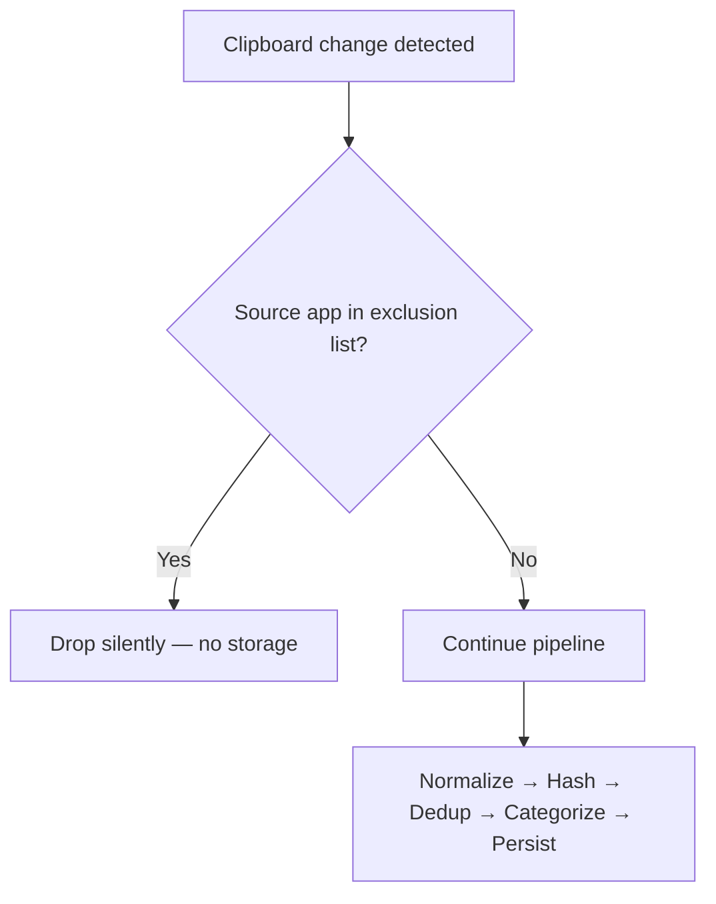
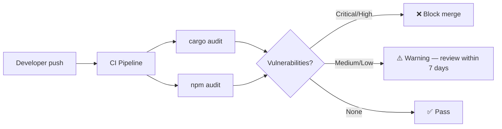

# ORNAS — Security Model

> Canonical reference: [ARCHITECTURE_FINAL.md](../ARCHITECTURE_FINAL.md)

---

## 1. Overview

ORNAS operates under a **zero-trust-the-network, trust-the-local-OS** model. It makes zero
network calls (Principle 7), stores data under OS file permissions, and scopes every IPC
command through Tauri v2 Capabilities. This document details every security boundary,
threat, and mitigation for V1.0.

---

## 2. STRIDE Threat Model

| ID | Category | Threat | Severity | Attack Vector | Mitigation | Status |
|----|----------|--------|----------|---------------|------------|--------|
| S1 | **Spoofing** | Rogue process sends IPC commands to Tauri backend | Medium | Local process impersonation | Tauri v2 origin validation; only registered WebView windows can invoke commands | ✅ Mitigated |
| S2 | **Spoofing** | Malicious clipboard content mimics system prompts | Low | Social engineering via pasted text | Content rendered as escaped text; no `innerHTML` or `eval()` anywhere | ✅ Mitigated |
| T1 | **Tampering** | Direct SQLite file modification | Medium | Local file write access | OS file permissions (`0600`); integrity checks via `PRAGMA integrity_check` on startup | ✅ Mitigated |
| T2 | **Tampering** | Clipboard content mutated between capture and storage | Low | Race condition in pipeline | Pipeline processes immutable snapshot; debounce prevents partial reads | ✅ Mitigated |
| R1 | **Repudiation** | User denies deleting clip history | Low | No audit log | Out of scope for V1.0; structured `tracing` logs record destructive operations | ⚠️ Accepted |
| I1 | **Info Disclosure** | Passwords captured from clipboard | **High** | User copies from password manager | App exclusion list (1Password, Bitwarden, KeePass, LastPass); configurable in Settings | ✅ Mitigated |
| I2 | **Info Disclosure** | Database file exfiltrated | Medium | Malware reads `~/.local/share/ornas/` | OS file permissions (`0600`); V1.2 adds SQLCipher encryption | ⚠️ Partial |
| I3 | **Info Disclosure** | Clipboard content visible in memory dump | Low | Memory forensics | Data cleared from Rust buffers after pipeline; OS memory protections apply | ⚠️ Accepted |
| D1 | **Denial of Service** | Extremely large clipboard content exhausts memory | Medium | Copy 100MB+ text to clipboard | `max_image_size_bytes` cap (10 MB); text truncated at pipeline normalizer stage | ✅ Mitigated |
| D2 | **Denial of Service** | Rapid clipboard spam fills database | Low | Automated clipboard scripts | Debounce (100ms); dedup via xxHash64 LRU cache (500 entries); pruning task | ✅ Mitigated |
| E1 | **Elevation** | WebView JavaScript escapes sandbox | Medium | WebView exploit | Strict CSP; Tauri capability scoping; no dynamic script loading | ✅ Mitigated |
| E2 | **Elevation** | Search window gains write access | Medium | Misconfigured capabilities | Separate capability file (`search-window.json`) with read-only permissions | ✅ Mitigated |

---

## 3. Tauri v2 Capabilities

Capabilities enforce **per-window permission scoping**. Each window declares exactly which
Tauri commands and plugin APIs it may access.

### 3.1 Main Window (`main-window.json`)

```json
{
  "identifier": "main-capability",
  "description": "Full access for the primary application window",
  "windows": ["main"],
  "permissions": [
    "core:default",
    "core:event:default",
    "core:window:default",
    "global-shortcut:default",
    "dialog:default",
    {
      "identifier": "fs:default",
      "allow": [{ "path": "$APPDATA/**" }]
    }
  ]
}
```

### 3.2 Search Window (`search-window.json`)

```json
{
  "identifier": "search-capability",
  "description": "Read-only access for the global search popup",
  "windows": ["search"],
  "permissions": [
    "core:default",
    "core:event:default"
  ]
}
```

### 3.3 Permission Comparison

| Permission | Main Window | Search Window | Rationale |
|------------|:-----------:|:-------------:|-----------|
| `core:default` | ✅ | ✅ | Basic Tauri runtime |
| `core:event:default` | ✅ | ✅ | Receive `clip-created` events |
| `core:window:default` | ✅ | ❌ | Window management (minimize, resize) |
| `global-shortcut:default` | ✅ | ❌ | Hotkey registration |
| `dialog:default` | ✅ | ❌ | Confirmation dialogs (delete all) |
| `fs:default` (scoped) | ✅ `$APPDATA/**` | ❌ | Image file read for previews |
| Custom IPC write commands | ✅ | ❌ | Delete, favorite, pin, settings |
| Custom IPC read commands | ✅ | ✅ | Search, list, get |

---

## 4. Content Security Policy (CSP)

Configured in `tauri.conf.json` under `app.security.csp`:

```
default-src 'self';
script-src  'self';
style-src   'self' 'unsafe-inline';
img-src     'self' asset: https://asset.localhost;
font-src    'self' data:;
connect-src ipc: http://ipc.localhost;
object-src  'none';
base-uri    'self';
form-action 'none';
```

| Directive | Value | Why |
|-----------|-------|-----|
| `default-src` | `'self'` | Deny everything not explicitly allowed |
| `script-src` | `'self'` | No inline scripts, no CDN, no `eval()` |
| `style-src` | `'self' 'unsafe-inline'` | Tailwind JIT generates inline styles |
| `img-src` | `'self' asset:` | Load images from Tauri asset protocol |
| `connect-src` | `ipc:` | Only Tauri IPC bridge — no HTTP, no WebSocket |
| `object-src` | `'none'` | Block Flash, Java, plugins |
| `form-action` | `'none'` | No form submissions (SPA) |

---

## 5. Sensitive Data Handling

### 5.1 Password Manager Detection



**Default exclusion candidates** (user-configurable in Settings):

| App Name | Platform | Identifier |
|----------|----------|------------|
| 1Password | All | `1Password`, `com.1password.*` |
| Bitwarden | All | `Bitwarden`, `com.bitwarden.*` |
| KeePassXC | All | `KeePassXC`, `org.keepassxc.*` |
| LastPass | All | `LastPass`, `com.lastpass.*` |
| Dashlane | All | `Dashlane`, `com.dashlane.*` |

> The exclusion list is stored in `AppConfig.excluded_apps` (domain layer) and
> persisted in the `settings` table. Detection uses the platform-specific source
> app string returned by the clipboard monitor's metadata stage.

### 5.2 Clipboard Content Rendering

| Risk | Prevention |
|------|-----------|
| XSS via pasted HTML | All content rendered via `textContent`, never `innerHTML` |
| Script injection in preview | Preview is a truncated plain-text string (200 chars) |
| Image-based exploits | Images rendered via `` with Tauri asset protocol, no blob URLs |

---

## 6. Privacy Controls

ORNAS is **offline-only by design** (Principle 7). Privacy is not a feature toggle —
it is an architectural invariant.

| Control | Implementation | Configurable? |
|---------|---------------|:-------------:|
| **Zero telemetry** | No telemetry code exists in the codebase | N/A |
| **Zero network** | No HTTP client, no WebSocket, no DNS lookup in any dependency | N/A |
| **App exclusion** | `excluded_apps: Vec<String>` in `AppConfig` | ✅ Settings |
| **Retention period** | Auto-prune after N days (default: 90) | ✅ 7 / 30 / 90 / 365 / unlimited |
| **Clear on exit** | Delete all non-favorite clips on app close | ✅ Settings |
| **Max history size** | Cap at N items (default: 10,000) | ✅ Settings |
| **Max image size** | Skip images above N bytes (default: 10 MB) | ✅ Settings |
| **Manual clear** | "Clear All History" in command palette | Always available |

### Network Verification

```bash
# Verify zero network code in Rust dependencies
cargo tree | grep -iE "reqwest|hyper|ureq|surf|curl|tungstenite"
# Expected: no results

# Verify zero network code in JS dependencies
grep -r "fetch\|XMLHttpRequest\|WebSocket" src/ --include="*.ts" --include="*.tsx"
# Expected: only Tauri IPC invoke() calls
```

---

## 7. Supply Chain Security

### 7.1 Dependency Audit Pipeline



### 7.2 Audit Commands

| Tool | Command | Runs On | Blocks CI? |
|------|---------|---------|:----------:|
| `cargo audit` | `cargo install cargo-audit && cargo audit` | Every PR, nightly | ✅ Critical/High |
| `npm audit` | `npm audit --audit-level=high` | Every PR, nightly | ✅ Critical/High |
| `cargo deny` | `cargo deny check advisories bans` | Weekly | ⚠️ Warning |

### 7.3 Dependency Pinning Strategy

| Ecosystem | Strategy | File |
|-----------|----------|------|
| Rust | Exact versions in `Cargo.lock` (committed) | `src-tauri/Cargo.lock` |
| Node.js | Exact versions in `package-lock.json` (committed) | `package-lock.json` |
| CI runners | Pin action versions by SHA | `.github/workflows/*.yml` |

### 7.4 Dependency Inventory

| Ecosystem | Direct Deps | Justification Reviewed? |
|-----------|:-----------:|:-----------------------:|
| Rust | 11 | ✅ See §4 of ARCHITECTURE_FINAL.md |
| JavaScript | 9 runtime | ✅ See §4 of ARCHITECTURE_FINAL.md |

> Every dependency was individually evaluated for necessity in the architecture
> review. No dependency exists without a concrete use case (Principle 3).

---

## 8. Database File Security

| Aspect | V1.0 | V1.2 (Planned) |
|--------|------|----------------|
| File permissions | `0600` (owner read/write only) | Same |
| Encryption | None | SQLCipher or AES-256-GCM |
| Key storage | N/A | OS keyring (Secret Service / Keychain / DPAPI) |
| Backup encryption | N/A | Encrypted at rest |

### File Permission Enforcement

```rust
// infrastructure/database/connection.rs
#[cfg(unix)]
fn set_db_permissions(path: &Path) -> Result<()> {
    use std::os::unix::fs::PermissionsExt;
    std::fs::set_permissions(path, std::fs::Permissions::from_mode(0o600))?;
    Ok(())
}
```

---

## 9. Security Checklist (Code Review)

Every PR touching security-sensitive code must verify:

- [ ] No `innerHTML`, `dangerouslySetInnerHTML`, or `eval()` introduced
- [ ] No new network-capable dependencies added
- [ ] Tauri capability files unchanged (or change reviewed by maintainer)
- [ ] `excluded_apps` logic tested with mock source app strings
- [ ] `cargo audit` and `npm audit` pass with zero critical/high findings
