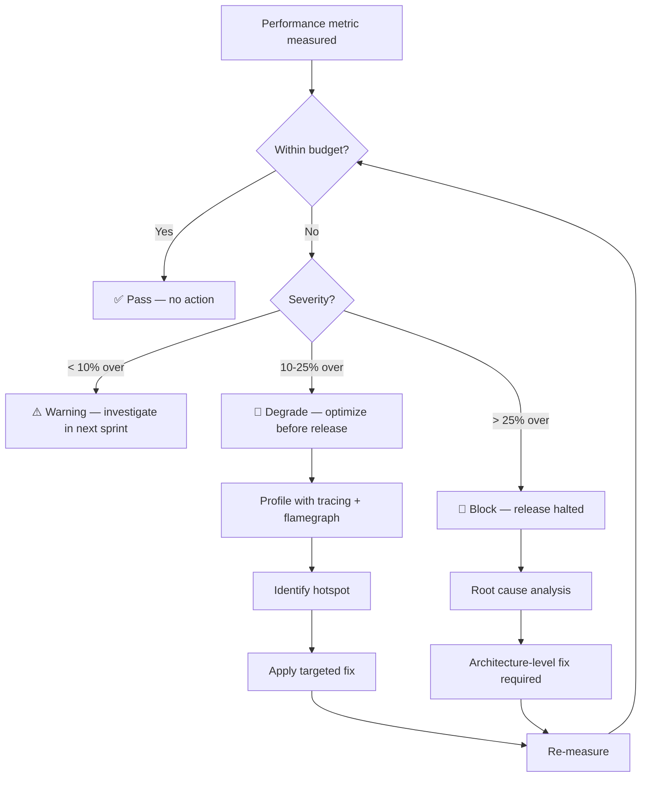

# ORNAS — Performance Strategy

> Canonical reference: [ARCHITECTURE_FINAL.md](../ARCHITECTURE_FINAL.md)

---

## 1. Overview

Performance is a **hard constraint**, not a goal. Every metric in this document has a
PASS/FAIL threshold. Violations block release. ORNAS must feel instant — clipboard
capture is invisible, search is immediate, and scrolling never drops a frame.

---

## 2. Performance Budgets (HARD Constraints)

| Metric | HARD Limit | Expected | Measurement Method |
|--------|:----------:|:--------:|-------------------|
| Cold startup | < **2s** | ~1s | `std::time::Instant` from `main()` to first `clip-list` render |
| Warm startup | < **500ms** | ~300ms | OS process cache; same instrumentation |
| Memory — idle | < **150 MB** | ~85 MB | OS task manager / `proc_self_status` on Linux |
| Memory — active | < **250 MB** | ~100 MB | Peak RSS during search + scroll + preview |
| Search latency (10k items) | < **50ms** | ~20ms | Rust `tracing::instrument` on `SearchService::search` |
| Search latency (100k items) | < **100ms** | ~60ms | Same, with synthetic 100k dataset |
| Clipboard capture | < **20ms** | ~10ms | `Instant` span around pipeline `process()` |
| List scroll | **60 FPS** | 60 FPS | Chrome DevTools Performance tab, no jank frames |
| Binary size | < **15 MB** | ~10 MB | `ls -la` on release build artifact |
| Database size (90d, medium) | < **100 MB** | ~40 MB | `PRAGMA page_count * page_size` |

---

## 3. Violation Response Plan



| Severity | Threshold | Action | Timeline |
|----------|-----------|--------|----------|
| ✅ Pass | Within budget | None | — |
| ⚠️ Warning | < 10% over | Track, investigate next sprint | 2 weeks |
| 🔶 Degrade | 10–25% over | Optimize before release | Must fix |
| 🔴 Block | > 25% over | Release halted, root cause analysis | Immediate |

---

## 4. Per-Subsystem Strategies

### 4.1 Startup

```
Sequential startup budget breakdown:

  Parse CLI args ................. ~1ms
  Resolve data directory ......... ~1ms
  Open SQLite + PRAGMAs .......... ~22ms
  Run migrations (first run) ..... ~50ms (skip if current)
  Build AppState ................. ~5ms
  Start clipboard monitor ........ ~5ms
  Register Tauri commands ........ ~2ms
  Register global shortcuts ...... ~5ms
  Create main window (WebView) ... ~500-800ms ← DOMINANT COST
  React app mount ................ ~100ms
  Initial query (50 clips) ....... ~30ms
                                   ───────────
                         Total:    ~750-1050ms
```

| Optimization | Impact | Applied? |
|-------------|--------|:--------:|
| Lazy-load settings panel, command palette, search window | –200ms perceived | ✅ |
| No splash screen (adds latency, not removes it) | –100ms | ✅ |
| Prune task deferred 10s after startup | –0ms (async) | ✅ |
| Image thumbnails via IntersectionObserver | –0ms startup, saves memory | ✅ |

### 4.2 Clipboard Pipeline


| Stage | Budget | Strategy |
|-------|:------:|----------|
| Normalizer | < 1ms | In-place string mutation, no allocation |
| Hasher | < 1ms | xxHash64 — streaming, zero-copy |
| Dedup | < 5ms | LRU cache (500 entries) avoids DB hit for recent items |
| Categorizer | < 3ms | Ordered regex: first match wins, most common patterns first |
| Metadata | < 1ms | Simple char/line counting, preview truncation |
| Persister | < 5ms | WAL mode, prepared statements, FTS5 trigger-based indexing |
| Notifier | < 1ms | `app_handle.emit()` — single event, no serialization |
| **Total** | **< 20ms** | Pipeline runs on background `tokio` task |

### 4.3 Search

| Scale | FTS5 Query | Fuzzy Re-rank | IPC + Render | Total |
|-------|:----------:|:-------------:|:------------:|:-----:|
| 1k items | ~2ms | ~1ms | ~5ms | **~8ms** |
| 10k items | ~5ms | ~2ms | ~5ms | **~12ms** |
| 100k items | ~15ms | ~5ms | ~5ms | **~25ms** |

**Key optimizations:**

| Optimization | Impact |
|-------------|--------|
| FTS5 `prefix='2,3'` index | 2× faster prefix queries (`json*`) |
| `unicode61 remove_diacritics 2` tokenizer | Accent-insensitive without custom tokenizer |
| Candidate limit (200) before fuzzy re-rank | Caps Rust-side computation |
| Result limit (50) to frontend | Caps serialization + render cost |
| Frontend debounce (150ms) | Prevents query spam during typing |
| TanStack Query `staleTime: 30s` | Prevents redundant re-fetches for same query |

### 4.4 List Rendering

| Technique | What It Solves |
|-----------|---------------|
| TanStack Virtual | Only DOM-mount visible rows (~20) out of thousands |
| `React.memo` on `ClipboardItem` | Prevent re-render unless props change |
| Stable `queryKey` per filter/page | TanStack Query deduplicates identical requests |
| CSS `content-visibility: auto` | Browser skips layout for off-screen content |
| `will-change: transform` on scroll container | GPU-composited scrolling |

**60 FPS guarantee:** With virtual scrolling, DOM node count stays constant (~20–30
nodes) regardless of list size. React reconciliation runs on a fixed-size set.

### 4.5 Memory Management

| Component | Budget | Strategy |
|-----------|:------:|---------|
| SQLite page cache | 16 MB (fixed) | `PRAGMA cache_size = -16000` |
| LRU dedup cache | 0.5 MB | Bounded at 500 entries; LRU eviction |
| TanStack Query cache | 2–5 MB | `gcTime: 5min`; stale data collected |
| Zustand store | < 0.1 MB | Primitives only — booleans, IDs, enums |
| Image thumbnails | 0–3 MB | Loaded on-demand via IntersectionObserver |
| Clipboard read buffer | < 0.1 MB | Single-use, dropped after pipeline |

**Escape hatch** (if memory exceeds budget):

| Action | Saves | Trade-off |
|--------|:-----:|----------|
| Reduce page cache to 8 MB | ~8 MB | More disk I/O on cold queries |
| Limit query cache to 2 pages | ~2 MB | More re-fetches on navigation |
| Reduce LRU to 200 entries | ~0.3 MB | More DB lookups for dedup |

### 4.6 Binary Size

| Component | Size | Optimization |
|-----------|:----:|-------------|
| Tauri runtime + Rust code | ~3 MB | `opt-level = "s"`, LTO enabled |
| Bundled SQLite | ~2 MB | Compiled with minimal features |
| React + dependencies | ~60 KB gzipped | Tree-shaking via Vite |
| WebView | 0 MB (OS-provided) | Native WebView, not bundled Chromium |
| Icons (Lucide, tree-shaken) | ~5 KB | Only imported icons included |
| **Total** | **~10 MB** | Well under 15 MB budget |

**Cargo release profile:**

```toml
[profile.release]
opt-level = "s"        # Optimize for size
lto = true             # Link-time optimization
codegen-units = 1      # Single codegen unit for better optimization
strip = true           # Strip debug symbols
panic = "abort"        # No unwinding overhead
```

---

## 5. Measurement Infrastructure

### 5.1 Rust-Side Instrumentation

```rust
// Every performance-critical path uses tracing spans
#[tracing::instrument(skip(self))]
pub async fn search(&self, query: &str) -> Result<Vec<Clip>> {
    // FTS5 query + fuzzy re-rank
}

#[tracing::instrument(skip(self, item))]
pub async fn process(&self, item: &mut ClipItem) -> Result<()> {
    // Pipeline stages
}
```

### 5.2 Frontend Instrumentation

```typescript
// Wrap critical paths with performance.mark / performance.measure
performance.mark('search-start');
const results = await invoke('search', { query });
performance.mark('search-end');
performance.measure('search-ipc', 'search-start', 'search-end');
```

### 5.3 CI Performance Checks

| Check | Tool | Threshold | Runs On |
|-------|------|:---------:|---------|
| Binary size | `ls -la` + script | < 15 MB | Every release build |
| Startup time | Integration test with timer | < 2s | Nightly |
| Search benchmark | Rust benchmark with 100k synthetic clips | < 100ms | Nightly |
| Dependency size audit | `cargo bloat --release` | No regression > 5% | Weekly |

---

## 6. Performance Anti-Patterns (Forbidden)

| Anti-Pattern | Why Forbidden | Alternative |
|-------------|--------------|-------------|
| `innerHTML` for content display | XSS risk + layout thrashing | `textContent` |
| Unbounded query results | Memory spike, render freeze | `LIMIT` clauses, pagination |
| Synchronous SQLite on main thread | Blocks UI event loop | `tokio::spawn_blocking` |
| `JSON.parse` in render loop | GC pressure per frame | Parse once, cache in store |
| CSS `box-shadow` on animated elements | Triggers paint per frame | Use `filter: drop-shadow` or avoid |
| `useEffect` for data fetching | Race conditions, no cache | TanStack Query |
| Snapshot tests on component trees | Slow CI, brittle, no UX value | Behavior-based testing |
