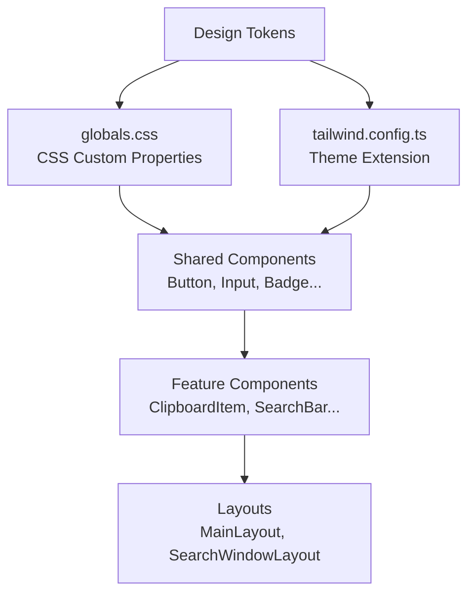

# ORNAS — Design System

> Canonical reference: [ARCHITECTURE_FINAL.md](../ARCHITECTURE_FINAL.md)

---

## 1. Overview

ORNAS uses a token-based design system implemented through **TailwindCSS 4.x**
custom theme configuration and **CSS custom properties**. All visual decisions
are encoded as tokens — no magic numbers in component code. The system supports
dark and light modes via a single class toggle on `<html>`.

---

## 2. Color Palette

### 2.1 Neutral Scale

The neutral scale is the backbone of the UI. Dark mode uses the high end
(neutral-800+), light mode uses the low end (neutral-50–200).

| Token | Hex (Dark) | Hex (Light) | Usage |
|-------|:----------:|:-----------:|-------|
| `neutral-50` | — | `#fafafa` | Light: page background |
| `neutral-100` | — | `#f5f5f5` | Light: card background |
| `neutral-150` | — | `#ededed` | Light: hover background |
| `neutral-200` | — | `#e5e5e5` | Light: border, divider |
| `neutral-300` | — | `#d4d4d4` | Light: disabled text |
| `neutral-400` | `#a3a3a3` | `#a3a3a3` | Placeholder text (both modes) |
| `neutral-500` | `#737373` | `#737373` | Secondary text (both modes) |
| `neutral-600` | `#525252` | — | Dark: secondary text |
| `neutral-700` | `#404040` | — | Dark: border, divider |
| `neutral-800` | `#262626` | — | Dark: card background |
| `neutral-850` | `#1f1f1f` | — | Dark: sidebar background |
| `neutral-900` | `#171717` | — | Dark: page background |
| `neutral-950` | `#0a0a0a` | — | Dark: deepest background |

### 2.2 Accent Color (Indigo)

| Token | Hex | Usage |
|-------|:---:|-------|
| `accent-400` | `#818cf8` | Dark mode: primary accent, links, active states |
| `accent-500` | `#6366f1` | Light mode: primary accent, links, active states |
| `accent-600` | `#4f46e5` | Hover state (light mode) |
| `accent-300` | `#a5b4fc` | Hover state (dark mode) |
| `accent-100` | `#e0e7ff` | Light mode: accent background (badges) |
| `accent-900` | `#312e81` | Dark mode: accent background (badges) |

### 2.3 Semantic Colors

| Token | Dark | Light | Usage |
|-------|:----:|:-----:|-------|
| `success` | `#4ade80` | `#16a34a` | Favorite star active |
| `warning` | `#fbbf24` | `#d97706` | Pinned indicator |
| `error` | `#f87171` | `#dc2626` | Delete confirmation, errors |
| `info` | `#60a5fa` | `#2563eb` | Category badges |

### 2.4 CSS Custom Properties

```css
/* styles/globals.css */
:root {
  --color-bg-primary: theme('colors.neutral.50');
  --color-bg-secondary: theme('colors.neutral.100');
  --color-bg-hover: theme('colors.neutral.150');
  --color-border: theme('colors.neutral.200');
  --color-text-primary: theme('colors.neutral.950');
  --color-text-secondary: theme('colors.neutral.500');
  --color-accent: theme('colors.indigo.500');
  --color-accent-hover: theme('colors.indigo.600');
}

.dark {
  --color-bg-primary: theme('colors.neutral.900');
  --color-bg-secondary: theme('colors.neutral.800');
  --color-bg-hover: theme('colors.neutral.700');
  --color-border: theme('colors.neutral.700');
  --color-text-primary: theme('colors.neutral.50');
  --color-text-secondary: theme('colors.neutral.400');
  --color-accent: theme('colors.indigo.400');
  --color-accent-hover: theme('colors.indigo.300');
}
```

---

## 3. Typography

### 3.1 Font Families

| Token | Font | Fallback Stack | Usage |
|-------|------|---------------|-------|
| `font-ui` | **Inter** | `system-ui, -apple-system, sans-serif` | All UI text |
| `font-mono` | **JetBrains Mono** | `ui-monospace, 'Cascadia Code', monospace` | Code content, hash displays, `<Kbd>` |

> Fonts are loaded locally (bundled in the Tauri binary), not from Google Fonts CDN.
> Zero network calls (Principle 7).

### 3.2 Type Scale

| Token | Size | Line Height | Weight | Usage |
|-------|:----:|:-----------:|:------:|-------|
| `text-xs` | 11px | 16px | 400 | Timestamps, metadata |
| `text-sm` | 13px | 20px | 400 | Secondary labels, badges |
| `text-base` | 14px | 22px | 400 | Body text, list items |
| `text-md` | 15px | 24px | 500 | Input fields, active items |
| `text-lg` | 18px | 28px | 600 | Section headings |
| `text-xl` | 20px | 30px | 700 | Panel titles |
| `text-2xl` | 24px | 32px | 700 | Settings page title |

### 3.3 Font Weight Tokens

| Token | Weight | Usage |
|-------|:------:|-------|
| `regular` | 400 | Body text |
| `medium` | 500 | Active list items, input text |
| `semibold` | 600 | Section headings, badge labels |
| `bold` | 700 | Page titles |

---

## 4. Spacing Scale

Base unit: **4px**. All spacing is a multiple of 4px.

| Token | Value | Common Usage |
|-------|:-----:|-------------|
| `space-0.5` | 2px | Icon-to-text gap (tight) |
| `space-1` | 4px | Inline element gap |
| `space-1.5` | 6px | Badge padding |
| `space-2` | 8px | Component internal padding |
| `space-3` | 12px | List item padding |
| `space-4` | 16px | Card padding, section gap |
| `space-5` | 20px | Panel padding |
| `space-6` | 24px | Section spacing |
| `space-8` | 32px | Major section gap |
| `space-10` | 40px | Page margin |
| `space-12` | 48px | Sidebar width unit |

---

## 5. Border Radius Tokens

| Token | Value | Usage |
|-------|:-----:|-------|
| `radius-sm` | 4px | Badges, small elements |
| `radius-md` | 6px | Buttons, inputs, cards |
| `radius-lg` | 8px | Panels, modals |
| `radius-xl` | 12px | Search window, command palette |
| `radius-full` | 9999px | Avatar, circular indicators |

---

## 6. Shadow Tokens

| Token | Value | Usage |
|-------|-------|-------|
| `shadow-sm` | `0 1px 2px rgba(0,0,0,0.05)` | Cards (light mode) |
| `shadow-md` | `0 4px 6px rgba(0,0,0,0.07), 0 2px 4px rgba(0,0,0,0.06)` | Dropdowns, tooltips |
| `shadow-lg` | `0 10px 15px rgba(0,0,0,0.10), 0 4px 6px rgba(0,0,0,0.05)` | Modals, search window |
| `shadow-dark-sm` | `0 1px 2px rgba(0,0,0,0.3)` | Cards (dark mode) |
| `shadow-dark-md` | `0 4px 6px rgba(0,0,0,0.4)` | Dropdowns (dark mode) |
| `shadow-dark-lg` | `0 10px 15px rgba(0,0,0,0.5)` | Modals (dark mode) |

> Dark mode uses higher opacity shadows because dark backgrounds absorb subtle shadows.

---

## 7. Animation & Transitions

**CSS only** — no JavaScript animation libraries in V1.0 (Principle 2).

### 7.1 Duration Tokens

| Token | Duration | Usage |
|-------|:--------:|-------|
| `duration-fast` | 100ms | Hover color changes, icon rotations |
| `duration-default` | 150ms | Button presses, toggle switches |
| `duration-medium` | 200ms | Panel show/hide, dropdown open |
| `duration-slow` | 300ms | Modal entrance, search window appear |

### 7.2 Easing Tokens

| Token | Value | Usage |
|-------|-------|-------|
| `ease-default` | `cubic-bezier(0.4, 0, 0.2, 1)` | General transitions |
| `ease-in` | `cubic-bezier(0.4, 0, 1, 1)` | Exit animations |
| `ease-out` | `cubic-bezier(0, 0, 0.2, 1)` | Entrance animations |
| `ease-spring` | `cubic-bezier(0.34, 1.56, 0.64, 1)` | Playful micro-interactions |

### 7.3 Standard Transition Definitions

```css
/* Applied via utility classes */
.transition-colors {
  transition-property: color, background-color, border-color;
  transition-duration: var(--duration-default);
  transition-timing-function: var(--ease-default);
}

.transition-opacity {
  transition-property: opacity;
  transition-duration: var(--duration-medium);
  transition-timing-function: var(--ease-out);
}

.transition-transform {
  transition-property: transform;
  transition-duration: var(--duration-medium);
  transition-timing-function: var(--ease-out);
}
```

### 7.4 Keyframe Animations

```css
@keyframes fade-in {
  from { opacity: 0; }
  to   { opacity: 1; }
}

@keyframes slide-up {
  from { opacity: 0; transform: translateY(4px); }
  to   { opacity: 1; transform: translateY(0); }
}

@keyframes spin {
  from { transform: rotate(0deg); }
  to   { transform: rotate(360deg); }
}
```

| Animation | Duration | Applied To |
|-----------|:--------:|-----------|
| `fade-in` | 150ms | List items appearing |
| `slide-up` | 200ms | Dropdown menus, tooltips |
| `spin` | 750ms (infinite) | Loading spinner |

---

## 8. Accessibility

### 8.1 Contrast Requirements

| Requirement | Standard | Target | Verification |
|-------------|----------|:------:|-------------|
| Normal text (< 18px) | WCAG 2.1 AA | **4.5:1** minimum | Checked against both themes |
| Large text (≥ 18px bold) | WCAG 2.1 AA | **3:1** minimum | Checked against both themes |
| UI components & graphics | WCAG 2.1 AA | **3:1** minimum | Borders, icons, focus rings |

### 8.2 Contrast Verification

| Combination | Dark Mode Ratio | Light Mode Ratio | Pass? |
|-------------|:---------------:|:----------------:|:-----:|
| Primary text on bg | neutral-50 on 900 → **15.4:1** | neutral-950 on 50 → **19.3:1** | ✅ |
| Secondary text on bg | neutral-400 on 900 → **7.3:1** | neutral-500 on 50 → **5.9:1** | ✅ |
| Accent on bg | indigo-400 on 900 → **5.2:1** | indigo-500 on 50 → **4.6:1** | ✅ |
| Accent on card bg | indigo-400 on 800 → **4.7:1** | indigo-500 on 100 → **4.5:1** | ✅ |

### 8.3 Focus Ring System

```css
/* Visible focus ring for keyboard navigation */
:focus-visible {
  outline: 2px solid var(--color-accent);
  outline-offset: 2px;
  border-radius: var(--radius-md);
}

/* Remove default focus for mouse clicks */
:focus:not(:focus-visible) {
  outline: none;
}
```

| Focus Property | Value | Rationale |
|---------------|-------|-----------|
| Style | `2px solid accent` | High visibility on both themes |
| Offset | `2px` | Prevents overlap with component border |
| Border radius | Matches component | Consistent appearance |
| `:focus-visible` only | Yes | No focus ring on mouse click |

### 8.4 Keyboard Navigation Tokens

| Element | Focus Order | Key Binding |
|---------|:-----------:|------------|
| Sidebar | 1 | `Tab` from search bar |
| Clipboard list | 2 | `Tab` from sidebar |
| Preview panel | 3 | `Space` toggle / `Tab` |
| Action buttons | 4 | `Tab` within preview |

### 8.5 Motion Preferences

```css
@media (prefers-reduced-motion: reduce) {
  *,
  *::before,
  *::after {
    animation-duration: 0.01ms !important;
    animation-iteration-count: 1 !important;
    transition-duration: 0.01ms !important;
  }
}
```

> All animations respect `prefers-reduced-motion`. Users who configure their OS
> to reduce motion will see instant state changes with no transitions.

---

## 9. Component Token Application



| Layer | Token Source | Example |
|-------|-------------|---------|
| CSS Custom Properties | `globals.css` | `var(--color-accent)` |
| Tailwind Theme | `tailwind.config.ts` | `bg-neutral-800`, `text-accent-400` |
| Component Props | Shared component API | `<Button variant="primary" size="sm">` |

> **Rule:** No hardcoded colors, font sizes, or spacing values in component files.
> Every visual value references a token. Violations are caught in code review.
