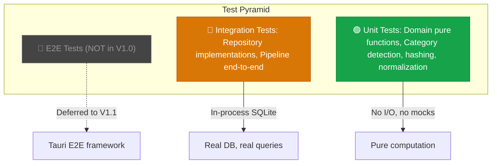
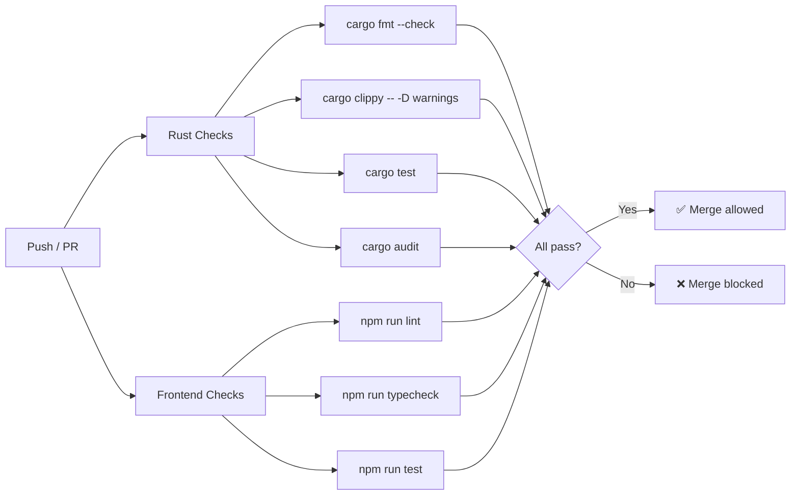

# ORNAS — Testing Strategy

> Canonical reference: [ARCHITECTURE_FINAL.md](../ARCHITECTURE_FINAL.md)

---

## 1. Philosophy

> **Principle 8:** Test at the boundary. Test domain logic with unit tests.
> Test integration at the repository boundary. Skip UI snapshot tests.

ORNAS tests are designed to catch **real bugs at real boundaries** — not to achieve
arbitrary coverage numbers or mirror implementation details. Every test answers the
question: *"If this test fails, is there a real bug that would affect users?"*

---

## 2. Testing Pyramid



| Layer | Count (est.) | Speed | What It Tests |
|-------|:------------:|:-----:|--------------|
| Unit tests | ~60 | < 1ms each | Pure domain logic: category detection, hashing, normalization, config defaults |
| Integration tests | ~25 | < 50ms each | Repository implementations against real SQLite, pipeline end-to-end |
| E2E tests | 0 (V1.0) | — | Deferred: full UI interaction via Tauri test framework |

---

## 3. Rust Unit Tests

### 3.1 What to Unit Test

Unit tests target **domain pure functions** — functions with no I/O, no database,
no filesystem, no network. They take input and return output deterministically.

| Module | Functions to Test | Example Assertion |
|--------|------------------|-------------------|
| `domain/category.rs` | `detect_category(content) → ContentCategory` | `detect_category("https://example.com") == Url` |
| `domain/category.rs` | Each category detection function | `is_json("{\"key\": 1}") == true` |
| `domain/clip.rs` | `NewClip` validation, `ClipUpdate` application | `NewClip::new("", "text")` returns error |
| `domain/config.rs` | `AppConfig::default()` values | `default().retention_days == 90` |
| `domain/pipeline.rs` | `StageAction` variants | `StageAction::Skip { reason }` pattern match |
| `infrastructure/pipeline/normalizer.rs` | Whitespace trim, CRLF → LF, NFC | `normalize("  hello\r\n") == "hello\n"` |
| `infrastructure/pipeline/hasher.rs` | xxHash64 determinism | `hash("test") == hash("test")` |

### 3.2 Unit Test Structure

```rust
// domain/category.rs
#[cfg(test)]
mod tests {
    use super::*;

    #[test]
    fn detects_url() {
        assert_eq!(detect_category("https://example.com"), ContentCategory::Url);
        assert_eq!(detect_category("http://localhost:3000/path"), ContentCategory::Url);
    }

    #[test]
    fn detects_email() {
        assert_eq!(detect_category("user@example.com"), ContentCategory::Email);
    }

    #[test]
    fn detects_json() {
        assert_eq!(detect_category(r#"{"key": "value"}"#), ContentCategory::Json);
    }

    #[test]
    fn plain_text_is_fallback() {
        assert_eq!(detect_category("just some text"), ContentCategory::PlainText);
    }

    #[test]
    fn empty_content_is_rejected() {
        // Normalizer rejects empty content before categorizer runs,
        // but categorizer should handle it gracefully anyway
        assert_eq!(detect_category(""), ContentCategory::PlainText);
    }
}
```

### 3.3 Unit Test Rules

| Rule | Rationale |
|------|-----------|
| One assertion per concept (not necessarily per function) | Easy to diagnose failures |
| Test name describes the behavior, not the method | `detects_url`, not `test_detect_category_1` |
| No I/O in unit tests | No file system, no database, no network |
| No mocks in unit tests | Domain functions are pure; mocks are unnecessary |
| `#[cfg(test)]` module at the bottom of the source file | Keeps tests close to code |

---

## 4. Rust Integration Tests

### 4.1 What to Integration Test

Integration tests verify **repository implementations** against a real in-memory SQLite
database. They cross the domain–infrastructure boundary.

| Module | What to Test | Setup |
|--------|-------------|-------|
| `database/clip_repo.rs` | CRUD operations on `clips` table | In-memory SQLite with schema |
| `database/search_repo.rs` | FTS5 queries return correct results | In-memory SQLite + seeded data |
| `database/settings_repo.rs` | Key-value read/write | In-memory SQLite with schema |
| `pipeline/runner.rs` | Full pipeline processes a clip end-to-end | In-memory SQLite + pipeline stages |
| `pipeline/dedup.rs` | Duplicate detection via hash lookup | In-memory SQLite + LRU cache |

### 4.2 Integration Test Structure

```rust
// tests/clip_repo_test.rs (or in-file integration section)

fn setup_test_db() -> Connection {
    let conn = Connection::open_in_memory().unwrap();
    conn.execute_batch(include_str!("../../migrations/001_initial.sql")).unwrap();
    apply_pragmas(&conn).unwrap();
    conn
}

#[test]
fn insert_and_retrieve_clip() {
    let conn = setup_test_db();
    let repo = SqliteClipRepo::new(&conn);

    let new_clip = NewClip {
        content_text: Some("Hello, world!".into()),
        content_type: "text".into(),
        content_hash: "abc123".into(),
        category: "plain_text".into(),
        ..Default::default()
    };

    let id = repo.insert(&new_clip).unwrap();
    let clip = repo.get_by_id(id).unwrap().unwrap();

    assert_eq!(clip.content_text.as_deref(), Some("Hello, world!"));
    assert_eq!(clip.category, "plain_text");
}

#[test]
fn search_returns_matching_clips() {
    let conn = setup_test_db();
    let repo = SqliteClipRepo::new(&conn);

    // Seed data
    repo.insert(&new_clip("Rust programming language")).unwrap();
    repo.insert(&new_clip("Python scripting")).unwrap();
    repo.insert(&new_clip("Rusty nail")).unwrap();

    let results = repo.search("rust*").unwrap();
    assert_eq!(results.len(), 2);
}

#[test]
fn delete_removes_clip_and_fts_entry() {
    let conn = setup_test_db();
    let repo = SqliteClipRepo::new(&conn);

    let id = repo.insert(&new_clip("Delete me")).unwrap();
    repo.delete(id).unwrap();

    assert!(repo.get_by_id(id).unwrap().is_none());
    assert!(repo.search("delete").unwrap().is_empty());
}
```

### 4.3 Integration Test Rules

| Rule | Rationale |
|------|-----------|
| Use `Connection::open_in_memory()` | Fast, isolated, no cleanup |
| Apply real schema via `include_str!("001_initial.sql")` | Tests real SQL, not mocked tables |
| Each test creates its own connection | Full isolation between tests |
| Test both success and error paths | `get_by_id(nonexistent)` returns `None`, not panic |

---

## 5. Frontend Tests

### 5.1 Tool: React Testing Library

| Tool | Purpose | Why |
|------|---------|-----|
| `@testing-library/react` | Component behavior testing | Tests what users see and do, not implementation |
| `vitest` | Test runner | Fast, Vite-native, TypeScript support |
| `@testing-library/user-event` | Simulate user interactions | Realistic event sequences |

### 5.2 What to Test on the Frontend

| What | How | Example |
|------|-----|---------|
| Hook return values | Render hook in test component | `useClipboardItems` returns items array |
| User interactions | `user.click()`, `user.type()` | Click delete → confirmation dialog appears |
| Conditional rendering | Assert element presence/absence | Empty state shows when items = [] |
| Keyboard navigation | `user.keyboard('{ArrowDown}')` | Arrow down moves selection |
| Accessibility | `getByRole()`, `getByLabelText()` | Buttons have accessible labels |

### 5.3 Frontend Test Example

```typescript
import { render, screen } from '@testing-library/react';
import userEvent from '@testing-library/user-event';
import { ClipboardItem } from './ClipboardItem';

test('displays clip content and category badge', () => {
  render(<ClipboardItem clip={mockClip} />);

  expect(screen.getByText('Hello, world!')).toBeInTheDocument();
  expect(screen.getByText('plain_text')).toBeInTheDocument();
});

test('calls onDelete when delete button is clicked', async () => {
  const onDelete = vi.fn();
  render(<ClipboardItem clip={mockClip} onDelete={onDelete} />);

  await userEvent.click(screen.getByRole('button', { name: /delete/i }));

  expect(onDelete).toHaveBeenCalledWith(mockClip.id);
});

test('shows favorite star when clip is favorited', () => {
  render(<ClipboardItem clip={{ ...mockClip, is_favorite: true }} />);

  expect(screen.getByLabelText('Favorited')).toBeInTheDocument();
});
```

---

## 6. What NOT to Test

| Anti-Pattern | Why It's Skipped | Alternative |
|-------------|-----------------|-------------|
| **Snapshot tests** | Brittle, break on any CSS change, no UX signal | Behavior-based assertions |
| **Implementation details** | Testing internal state/hooks breaks on refactor | Test via user-visible output |
| **Tauri IPC mocking** | Complex, fragile, doesn't catch real serialization bugs | Integration tests on Rust side |
| **CSS styling** | Visual verification is manual; CSS tests are meaningless | Design review + browser testing |
| **Third-party library internals** | TanStack Query, Zustand work correctly | Test your usage, not their code |
| **Trivial getters/setters** | No logic to break | Skip |
| **Private functions** | Test via public API that uses them | Unit test the public boundary |

---

## 7. CI Pipeline



### CI Job Details

| Job | Command | Blocks Merge? | Timeout |
|-----|---------|:-------------:|:-------:|
| Rust format | `cargo fmt --all -- --check` | ✅ | 2 min |
| Rust lint | `cargo clippy --all-targets -- -D warnings` | ✅ | 5 min |
| Rust tests | `cargo test --all` | ✅ | 5 min |
| Rust audit | `cargo audit` | ✅ (critical/high) | 2 min |
| JS lint | `npm run lint` (ESLint) | ✅ | 2 min |
| JS typecheck | `npx tsc --noEmit` | ✅ | 2 min |
| JS tests | `npx vitest run` | ✅ | 3 min |

**Total CI time target: < 10 minutes** for full PR pipeline.

---

## 8. Coverage Targets

| Layer | Target | Rationale |
|-------|:------:|-----------|
| Domain (`domain/`) | **80%** | Pure logic — high value, easy to test |
| Infrastructure (`infrastructure/`) | **60%** | I/O-heavy — test boundaries, not wiring |
| Commands (`commands/`) | **40%** | Thin wrappers — validated via integration tests |
| Frontend components | **50%** | Behavior tests on interactive components |
| Frontend hooks | **70%** | Logic-heavy — high value |
| Frontend utils | **90%** | Pure functions — trivial to test |

### Coverage Rules

| Rule | Details |
|------|---------|
| Coverage is a **guideline**, not a gate | CI does not block on coverage % |
| New domain code requires tests | PR review checks this |
| Bug fixes require a regression test | Prove the bug existed, prove it's fixed |
| Coverage tool | `cargo-llvm-cov` (Rust), `vitest --coverage` (JS) |

---

## 9. Test Data Strategy

| Need | Approach |
|------|----------|
| Rust unit test data | Inline constants + builder functions |
| Rust integration test data | `setup_test_db()` + `new_clip()` helper |
| Frontend test data | `mockClip`, `mockSettings` factory functions in `__tests__/fixtures.ts` |
| Performance benchmarks | Synthetic dataset generator (100k clips with varied categories) |

```rust
// Test helper — used across integration tests
fn new_clip(content: &str) -> NewClip {
    NewClip {
        content_text: Some(content.into()),
        content_type: "text".into(),
        content_hash: compute_hash(content),
        category: detect_category(content).as_str().into(),
        preview: Some(content.chars().take(200).collect()),
        char_count: content.len() as i64,
        line_count: content.lines().count() as i64,
        ..Default::default()
    }
}
```

---

## 10. What Changes in V1.1+

| Version | Testing Addition |
|---------|-----------------|
| V1.1 | E2E tests with Tauri test framework (WebDriver) |
| V1.1 | Visual regression tests for new syntax highlighting |
| V1.2 | Security tests for encrypted storage |
| V2.0 | Plugin SDK test harness (WASM sandbox validation) |
